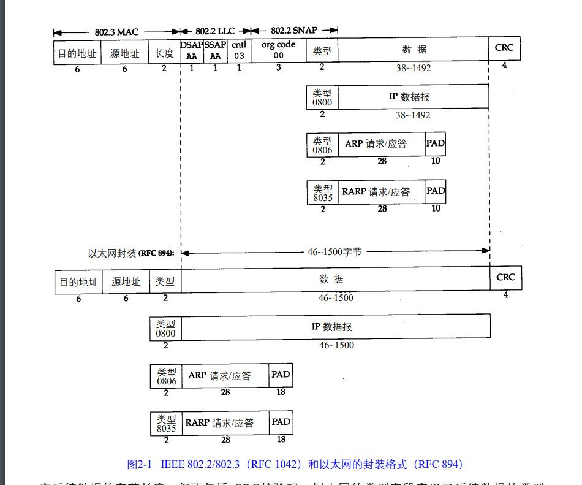

# 链路层
## 引言
```
链路层的三个目的
1.IP模块发送和接受数据报
2.ARP模块的发送和接收ARP应答
3.RARP发送RARP和接受RARP应答

TCP/IP支持多种不同链路层协议，这取决于所使用的硬件
  以太网 令牌环网 FDDI(光纤分布式数据接口) RS-2D2 串行线路等


下面将讨论
  1.两个串行接口链路层协议 SLIP 和 PPP
  2.大多数实现都包含环回(loopback)驱动程序
  3.MTU
```
## 以太网和 IEEE802封装
```
以太网:
  一般指数字设备公司,英特尔公司(Intel) 和 Xerox 公司 联合公布的标准
  当今TCP/IP局域网采用的技术
  CSMA/CD媒体接入技术(带有冲突检查的载波侦听多路接入术)。速率10mb/s 地址48bits


802.3 针对CSMA/CD技术
802.4 令牌总线网络
802.5 令牌环网络

上面三种共同的特征由802.2

不幸的是802.2 定义了一个和 802.3以太网不同的帧格式


以太网IP数据数据报的封装是在RFC894中定义的 (最常使用)
IEEE802的IP数据报封装在RFC1042定义

主机需求(每台主机)
  1.每台主机必须能够接收采用和发送RFC894(以太网)封装的格式的分组
  2.应该能够接收RFC894 混合 和RFC1042(IEEE802) 封装格式的分组
  3.也许能够发送采用RFC1042格式封装分组,
     note: 如果主机能够同时发送RFC894和 RFC1042(IEEE802) 则需要发送的分组必须能够可以设置,
     默认的条件下必须是RFC894


```

```
802.2 IP数据包RFC1042
  长度:后续字节长度,不包括CRC检验码
  在后续定义了类型(后续子网接入)

802.3 IP数据包RFC894
   类型(后续子网接入)
   

802.2 和  802.3 的 IP (有效)长度  和 类型 是不重合的  可以进行区分
    802.2  长度 
       最常 1492(0x05D4)
    802.3 类型
       0x0800 
       0x0806
       0x8035


802.2
  [3 byte LLC] 

  DSAP(目的访问点) OXAA
  SSAP(源服务访问点) OXAA
  Cnrl 3
 
  [5 byte SNAP]
  org code 0x00  0x00   0x00 
  类型 和 802.3一样

  


802.3 标砖定义帧和以太网帧都有最小长度要求
  部分数据最少38字节
  以太网最少46 字节

  note: 当发送数据少于最小长度的时候需要填充数据到最小长度

```
## 尾部封装
```
RFC893描述了另一种以太网封装格式,称为尾部封装

```


## SLIP:串行线路
```
家庭中的计算机几乎都有RS-232串行端口和高速调制解调器接入Internet

```