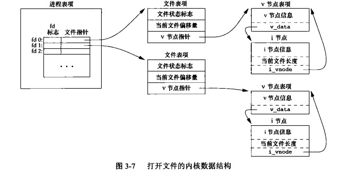
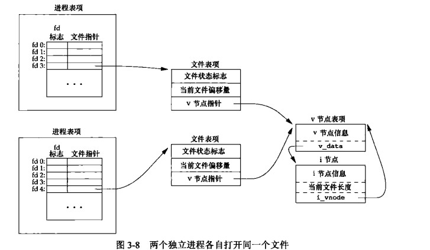

# 文件IO
## 3.1引言
```
open read write lseek close
上面的函数被称为不带缓冲区的函数 是 POSIX.1 和 Single UNIX Specification 标准的组成部分
```
## 3.2 文件描述符号
```c

STDIN_FIFLENO 0 标准输如
STDOUT_FILENO 1 标准输出
STDERR_FIFENO 2 标砖错误


note:
 每个进程打开文件是有上限的
 #include<unistd.h>
  long sysconf(int name);
  OPEN_MAX
  获取在进程上同时打开文件的最大文件个数限制

```
## 3.3 函数open和openat
```c
       #include <sys/types.h>
       #include <sys/stat.h>
       #include <fcntl.h>

       int open(const char *pathname, int flags);
       int open(const char *pathname, int flags, mode_t mode);

       int creat(const char *pathname, mode_t mode);

       int openat(int dirfd, const char *pathname, int flags);
       int openat(int dirfd, const char *pathname, int flags, mode_t mode);

       /* Documented separately, in openat2(2): */
       int openat2(int dirfd, const char *pathname,
                   const struct open_how *how, size_t size);


       int open(const char *pathname, int flags);
       int open(const char *pathname, int flags, mode_t mode);

       note:
         只有当创建新文件的时候才会使用最后一个参数


open 和  openat 返回的是最小的未使用的描述符数值


open 和 openat 区分
 1.pathname 是绝对地址 这种情况下 dirfd 会被忽略
 2.pathname 是相对地址 dirfd 指出相对应文件系统中的开始位置
 3.pathname 是相对地址 fd 参数具有特殊值 AT_FDCWD
             路径名在当前工作目录中获取,openat 与 open 基本相似


openat 是POSIX.1 新增加的一类函数
  解决了两个问题:
    1.非当前工作目录作为开始,指定目录作为相对地址的开始
    2.避免TOCITOU 错误
          call 1 result1 
        result1 -->call 2

        call1 和 call2 并不是原子操作
        call1 调用 返回 result1 在通过 result1 结果调用 call2 中间可能 call1 调用的结果已经改变,所以会造成函数的调用的最终结果是错误的，
```

### 文件名和路径名的截断
```
早期 System V 
  总是将长于14字符的文件名字截断,不会给出任何信息
BSD 
  超出文件名长度的最大限制 ,会返回错误
  errno 设置为ENAMETOOLONG


POSIX.1 中
  常量 _POSIX_NO_TRUNC 决定是要截断过长的文件名和路径名,还有返回的一个错误
  fpathconf 或者 pathconf 来查询目录具体支持何种行为
    到底是阶段过长文件名还是返回错误

  
```
## 函数create
```c
#include <sys/types.h>
#include <sys/stat.h>
#include <fcntl.h>
int creat(const char *pathname, mode_t mode);

note:
  上面的函数等效于
  open(path,OWRONLY|O_CREAT|O_TRUNC,mode);


create 不足：:
  是 OWRONLY 只写方式
  如果需要先写并且 在对该文件 需要 create close 
  然后 在调用open

```
## 函数close
```c
       #include <unistd.h>

       int close(int fd);


关闭该文件 并会释放进程加载该文件上的记录锁

note:
  进程终止 如果文件没有显示 close文件 则会在进程终止的时候隐式的关闭
```

## 函数lseek
```c
       #include <sys/types.h>
       #include <unistd.h>

       off_t lseek(int fd, off_t offset, int whence);

where
 SEEK_SET
  文件偏移量为问开始处offset
SEEK_CUR
  offset 可正可负
SEEK_END


lseek 返回一个文件的偏移量

off_t currpos;
currpos=lseek(fd,0,SEEK_CUR);
通过上面的方式可以确定打开文件的平移量或前面是否设置了偏移量

fd (管道，FIFO,网络套接字) 则 lseek 返回-1 ,并将errno 设置为ESPIPE


note:
  lseek 
    普通文件 lseek 不可能为负数
    有些设备 lseek 返回的是负数
    lseek 必须通过判断 是否为-1 l来是判断是否为错误


off_t 在大多数平台提供两组接口处理文件偏移量
  32 or 64


note:
   尽管实现64位文件偏移量,但是能否创建一个大于2GB(2^31  -1) 的文件  还是要根据底层的文件系统

```
## 函数
```c
#include <unistd.h>
ssize_t read(int fd, void *buf, size_t count);

return 返回读取到的字节数,返回0则文件已经读取到了文件的末尾


1.普通文件读取
  file size 30 bytes
  read(fd,buf,100)
  1.read() 第一次返回 30 
  2.read() 第二次返回 0 代表已经读取到末位

2.终端设备读取
   最多读取一行

3.网络
  网络中的缓冲机制可能造成返回值小于所有的字节数
4.管道or FIFO 读取时
    read 将返回实际可用的字节数
5.记录设备(磁带)
  一次最多返回一个记录

6.信号造成 阻塞函数read() 中断


ssize_t 有符号类型
 -1 出错 0 末尾


size_t 在历史上是无符号整形
  16 bits 实现  一次 最多允许 65534 字节的读写


1990 POSIX.1 标准中 引入 ssize_t 类型


size (SSIZE_MAX) 

```

## 函数wriet
```c
#include <unistd.h>
ssize_t write(int fd, const void *buf, size_t count);

返回值通常和传入的count 一样 否则出错


write 出错的原因 通常已经 写满,或则超过了给定进程的文件长度限制


普通文件
   通常写入数据的位置当前文件偏移量的地方

   当调用write成功后则当前文件的偏移量则是
  new offset=  old offset + wirite count

```
## I/O 的效率
```
linux ext4 文件系统中  磁盘块场4k=4096 byte

大多数文件系统为了改善性能都采用某种预读技术,当检查到顺序读取的时候，系统时就会试图会读取的比
```
## 文件共享

```
Unix 支持在不同的进程共享文件

1.
进程表项(打开文件描述表)

  fd(标志)   文件指针
   0           fptr


2.内核为所有打开文件维持一张文件表
  文件状态标志
    读,写,添写,同步,阻塞等信息
  当前文件偏移量
  v节点指针
  


3.v节点表(v-node 结构)
   v节点信息

   v_data

   i-node(索引节点)
      打开文件的时候从磁盘读入内存的
      包含一下信息
          1.文件所有者
          2.实际数据块在磁盘的位置
          3.文件的长度
          .....


note:
  Linux没有v节点而是使用通用的i节点

  linux 实现是将两个i节点
     与文件系统相关的i节点
     与文件系统无关的i节点

v 节点 创建的目的
   是为了对多个文件系统提供支持(适配多个文件系统)


```

```
// 用户进程
每个进程有自己私有的进程表项(fd + 文件表止指针)


// 内核
每个进程打开文件有存放每个进程打开文件的文件表项(每个进程独有)


v-node 和  i-node  多个进程通用(多个进程打开多个同一个文件)


1.write 后 文件表偏移量的数据修改(每个进程私有)

2.lseek 只修改文件表当前的偏移量,不进行任何I/O操作
  

note:
  1.多个文件描述符号指向同一个文件表项(3.12节 dup)
  2.fork 父进程和子进程 共享同一个文件表项

  (fcntl可以修改文件描述符标志和文件状态标志)

```
## 原子操作
### 追加到一个文件
```
A 进程
      open xxx.txt 文件    没有使用O_APPEND 
B 进程
     open xxx.txt 文件 没有使用O_APPEND 
    

A B  两个进程有自己的进程表项
不同的文件描述符对应则 在内核里的两个独立的文件表项

A
 lseek(fd,1500,0)
B
 lseeek(fd,1500,0)

v-node A B共享

B write()
  offset 1600
  file size 1600 (i-node file length 信息更新)

A 恢复执行
  A write()
    此时A在offset 1500 的地方写入内容会覆盖B的内容


解决上面的问题?
  unix 提供了一种原子操作方式以O_APPEND 标志打开,在每次内核写入东西前会设置lseek 位置为文件末尾,这样就不需要再每次write 前调用lseek

```
### 函数pread和 pwrite
```c

Single UNIX Specification 包括XSI扩展,该操作允许原子性的定位并执行I/O操作

NAME
       pread, pwrite - read from or write to a file descriptor at a given offset

SYNOPSIS
       #include <unistd.h>

       ssize_t pread(int fd, void *buf, size_t count, off_t offset);
      相当于调用lseek 和 read


       ssize_t pwrite(int fd, const void *buf, size_t count, off_t offset);
       相当于调用lseek 和 write

```
### 创建一个文件
```
O_EXCL:
   O_CREAT  和  O_EXCL 在open 中同指定
    如果该文件已经存在则会出错,否则创建该文件

    

O_CREAT O_EXCL

note:
  open(xx,O_EXCL|O_CREAT) 判断文件是否存在并且创建文件是原子操作

```
## 函数dup和dup2
```c
       #include <unistd.h>

       int dup(int oldfd);
       int dup2(int oldfd, int newfd);

错误返回-1,成功返回文件描述符号


dup(fd) 返回当前可用文件描述符的最小值
dup2(fd,fd2) 
  如果 fd2 打开则先关闭
  fd==fd2 则 返回fd2 ,不会关闭fd2


```

的内核数据结构.jpg)
```
newfd=dup(1)

newfd 的值是3

进程表项
fd1 ptr
fd3  ptr

fd1 和 fd3 ptr 指向同一个文件表
fd1 和 fd3 共享同一文件状态标志(读,写,追加,以及同一个文件的偏移量)


note:
  进程表里面fd标志是独立的
  新文件描述符执行关闭(close-on-exec) 标志总是由dup函数清除


dup2(fd,fd2)
  等效于
  close(fd2);
  fcntl(fd,F_DUPFD,fd2);


1.dup2() 原子操作
2.dup2 和 fcntl 有一些不同的errno
    POSIX.1 要求兼有 dup2 和 fcntl 的F_DUPFD 两种功能
```
## 函数 sync  和 fsync 和 fdatasync
```cpp
写入数据到磁盘流程(延迟写入)
  1.用户态buff 到  内核 buff
  2.排入对列
  3.写入到磁盘


note:
  内核重用缓冲区存其他磁盘数据的时候,则会把缓冲区flush 到磁盘


NAME
      fsync, fdatasync - synchronize a file's in-core state with storage device SYNOPSIS

       #include <unistd.h>

       void sync(void);

       int fsync(int fd);

       int fdatasync(int fd);


sync
 将所有谢盖过的缓冲区排入写队列
 note:
     sync() 返回并不意味着已经将buff 完全flush 到持久内存

     fsync(fd)  
        只对fd 文件起作用,并且等待磁盘操作结束才返回 
        并且会更新文件的属性
         note:
           可用于数据库程序,确保将修改的文件写入到磁盘返回

    
    fdatasync(fd)
     和 fsync类似 ,只会影响文件的数据,
     note:
      fdatasync 不会更新文件的数据

```

## 函数fcntl
```cpp


NAME
       fcntl - manipulate file descriptor

SYNOPSIS
       #include <unistd.h>
       #include <fcntl.h>

       int fcntl(int fd, int cmd, ... /* arg */ );

        return 成功 依赖于cmd;若出错误,返回-1


修改已经打开文件的属性

fcntl 函数有下面5种功能
1.复制一个已有的描述符号
  cmd =F_DUPFD  F_DUPFD_CLOEXEC 
2.获取/设置文件描述符标志
  cmd F_GETFL F_SETFL
3.获取/设置文件状态标志
  F_GETFL F_SETTFL
4.获取设置异步IO的所有权
 F_GETTOWN F_SETTOWN
5.获取设置记录锁
  F_GETLK F_SETLK F_SETLKW  


```