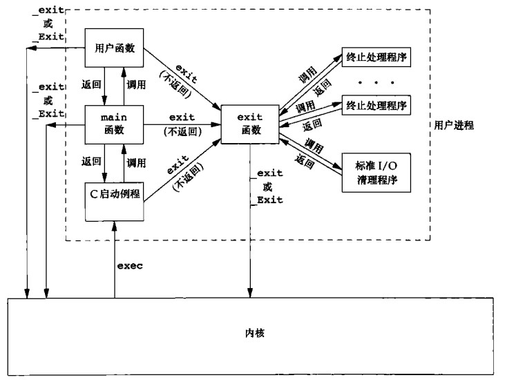
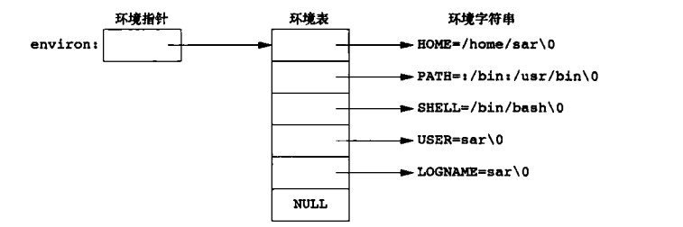
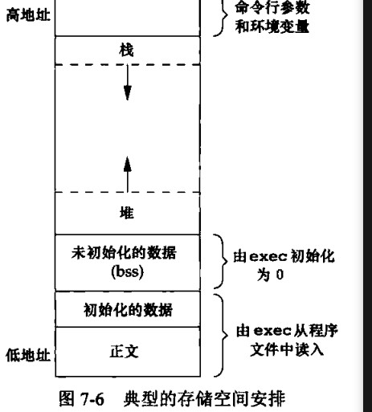

# 进程环境
## 引言
```
1.程序执行main函数如何被调用
2.命令行如何传递给新程序
3.存储空间布局的样式
4.如何分配另外的存储空间
5.如何使用环境变量
6.进程各种不同终止方式
7.longjmp setjmp 与栈的交互作用
8.查看进程的资源限制
```
## main函数
```c
int main(int argc,char *argv[])

argc命令行参数目录
argv指向参数各个指针所构成的数组


内核执行C程序的时候(使用exec函数),在调用main函数执之前会调用一个特殊启动例程

启动例程:
  程序起始地址,连接编辑器设置(c编译器调用)，
  启动例程调用 会从内核获取命令行参数和 环境变量值
```

## 进程终止
```
1.main函数返回
2.exit
3._exit或 _Exit
4.最后一个线程重启动例程返回
5.最后一个线程调用pthread_exit
6.调用abort
7.接到一个信号
8.最后一个线程取消请求做出回应


启动历程程序

__init(){
    xxx
    exit(main(argc,argv))
}
```
### 退出函数
```c

#include <stdlib.h> //ISO C说明的
void exit(int status);
   exit 总是执行标准IO库的清理关闭操作
   对所有打开的流调用fclose函数(缓冲区的数据会被flush)
void _Exit(int status);


#include <unistd.h> // POSIX.1 说明的
void _exit(int status);


status
  退回状态
  大多数UNIX系统shell地提供进程终止的状态方法


  a 调用上面这些函数不传入终止状态
  b main 执行无返回值 
  c main 函数没有申明函数的返回类型
  
  则进程终止的状态是未定义的


  note:
    main 函数返回是整数，执行到最后一条语句时返回(隐式返回),则进程的状态是0


#include<stdio.h>


main(){
    printf("main() 未定义返回类型、\n");
}


note:
  上面的代码 根据编译不同 执行完
  获取 echo $? 上一次执行的状态码 的内容可能有区别


main 函数返回整形的标准是ISO C和 POSX.1定义的

```
### 函数atxit
```c
NAME
       atexit - register a function to be called at normal process termination

SYNOPSIS
       #include <stdlib.h>

       int atexit(void (*function)(void));
      
       return 0 成功 
       return 非0 出错
    


atexit() 登记的顺序和调用的顺序是反的


#include <stdio.h>
#include <stdlib.h>

void atexit_1()
{
    printf("atexit_1\n");
}

void atexit_2()
{
    printf("atexit_2\n");
}
void atexit_3()
{
    printf("atexit_3\n");
}

int main()
{

    atexit(atexit_1);
    printf("register atexit_1\n");
    atexit(atexit_2);
    printf("register atexit_2\n");
    atexit(atexit_3);
    printf("register atexit_3\n");

    printf("main stop!!!\n");
}

执行结果
register atexit_1
register atexit_2
register atexit_3
main stop!!!
atexit_3
atexit_2
atexit_1


终止处理程序是有ASNI C标准1989年引入,早年间很多os系统都不提供终止处理程序


ISO C要求,系统至少应该支持32个终止处理程序(实现经常会提供更加多的数量终止处理程序)
  note: 可以使用sysconf 函数获取最多支持多少个终止处理程序

```

```
exit(){
  // 调用所有的终止程序
  // 关闭所有的打开流(fclose)
}


POSIX.1扩展了ISO C标准
  如果程序调用exec函数族中的任一函数,会清除当前进程
  的所有终止处理程序
 
 


note:
  内核使程序执行的唯一方法是调用exec函数
  进程终止的唯一方式是显示或隐式(exit调用)的调用_exit 或 _Exit

   进程也可以飞自愿的由一个信号将其终止

```

## 命令行参数
## 环境表

```c
每个程序都将接收到一张环境表


#include <stdio.h>

extern char **environ;

int main(int argc, char *argv[])
{
    printf("打印命令行参数\n");
    /**
     * note:
     *  有符号 和 无符号 则 有符号会被提升成无符号
     */
    for (int i = 0; i < argc; i++)
    {
        printf("argc:%d argv:%s \n", i + 1, argv[i]);
    }

    printf("打印环境表\n");

    char **tmpEnviron = environ;

    for (int i = 0; *(tmpEnviron) != NULL; i++)
    {
        printf("i:%d env:%s\n", i, *(tmpEnviron++));
    }
}


int main(int argc,char *argv[], char* envp[])
大多数UNIX支持main包含3个参数

ISO C 规定main 函数只有两个参数

POSIX.1 也 规定使用 environ 而不使用 第三个参数


访问特定的环境变量
SYNOPSIS
       #include <stdlib.h>
       char *getenv(const char *name);
       int putenv(char *string);
```
## C程序的存储空间布局

```
正文段
初始化数据段
  int cxxx=100; 就会在这个段

未初始化数据段(.bss)
  内核将此段中的数据初始化为0 or 空指针
  long sum[1000]; // 会将该数据放在.bss段中


栈
堆
  note：
   由于历史原因堆的区域在栈和.bss(未初始化数据段)之间


Inter x86 32 位
  [0x08048000,0xc0000000]


size 例举二进制文件每个段的大小
size atexit_t1
   text    data     bss     dec     hex filename
   1886     608       8    2502     9c6 atexit_t1


dec hex  前面三段总长
```

## 共享库
```
共享库使的可执行文件不在需要包含公用函数,而只需要所有进程都可以引用的存储区中保存这种库例程的一个副本


程序在第一调用某个库 和 调用某个函数的时候,用动态链接方法将程序和共享库相链接

优点:
   1.减小可执行文件的大小
   2.参数和类型没有改变的情况不不需要重新编译

缺点:
   额外增加运行时开销,打底衣执行库和函数的时候动态连接器会链接

```
## 存储空间分配
```c

ISO C规定了3个用于存储空间动态分配函数
#include <stdlib.h>
void *malloc(size_t size);
  分配指定字节的存储区
  返回的地址是不确定的
void *calloc(size_t nmemb, size_t size);
  分配指定大小的空间,并且初始化空间每一个bit 都初始化为0
void *realloc(void *ptr, size_t size);
  增加或减少一寝分配的区域长度
  增加长度
       将以前分配区域的内容移动到更加大的区域
  
  realloc 细节
  realloc 增加长度
    如果 ptr 后面还有空闲内存并且 够 size 大小 则 
    直接返回原地址

    如果ptr后面没后空闲空间 或 大小不足 则会找一个合适的区域
    把ptr内容移到 新区域 free 调 ptr 现在 返回新地址


     note:
        realloc size 参数 指定新区域内存大小,而非新旧之间长度之差

return 非 null 成功


malloc ,calloc  realloc 实现
  
        #include <unistd.h>
       void *sbrk(intptr_t increment);

  sbrk 允许扩充(或缩小)进程的堆
  malloc 和free 的实现一般都不会减小进程的堆空间,一般 free 后 把他放在哪里,用户后面分配在使用


  malloc(size)
    实际向操作系统请求内存的时候会请求的稍微大一些,
    请求到的额外空间,用来记录管理信息

     note:
        当写入数据到超过分配区域,或在分配区域前写入数据,则会修改另一块分配内存的管理信息
         
        这种操作相当危险,这种错误不会立即出现,则会运行相当长的一段时间导致程序崩溃

    


致命的错误
  1.free掉已经free的地址
  2.free 掉非malloc calloc realloc 的地址
  3.忘记free掉内存(内存泄漏) 内存资源会慢慢耗光


```
### 代替的存储空间分配程序
## 环境变量
```c
#include <stdlib.h>
char *getenv(const char *name);
int putenv(char *string);

环境变量 ，
  通常用户登录成功的时候启动shell中环境变量初始化


char *getenv(const char *name);
获取指定的环境变量


note:
  ISO C 没有定义任何环境变量


```
