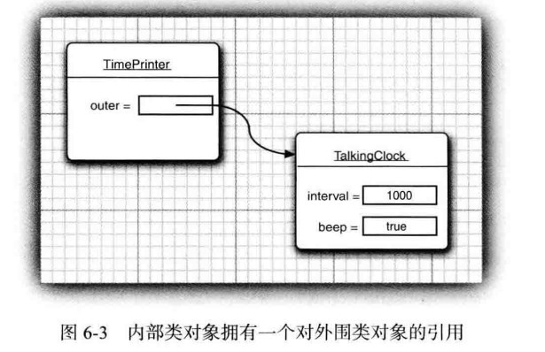

## 6.1 接口
```java
接口不是类

Arrays.sort 对对象进行排序 需要对象实现 Comparable 接口


```
## 6.4 内部类
```
为什么需要内部类
1.内部类可以访问外面类的的作用域的数据(note:包含私有数据)
2.内部类可以向同一个包中的其他类隐藏
3.使用回调函数不想编写大量代码，使用匿名内部类比较便捷

```
**code**
```java
public class TalkClock {
	private int interval;
	private boolean deep;

	public TalkClock(int interval, boolean deep) {
		this.interval = interval;
		this.deep = deep;
	}

	public TalkClock() {
		this(1000, true);
	}

	public class TimerPrinter {
		public void action() {
			System.out.println(interval);
			System.out.println(deep);
		}
	}
}


TimerPrinter 内部类既可以访问自身的数据域也可以访问外围类对象的数据域


```


```java
outer 引用 在内部类中是不可见的

编译器会在编译的时候修改内部类的构造器,添加一个外围类的引用参数


TimerPrinter tp= tClock.new TimerPrinter();


note:
  内部类声明未私有的,这样一来，只有TalkingClock方才能够构造私有内部类，
```

### 6.4.2 内部类的特殊语法规则
```java
内部类应用外围元素方式

System.out.println(interval);
System.out.println(deep);
System.out.println(TalkClock.this.interval);
System.out.println(TalkClock.this.deep);


内部类的构造
TimerPrinter tp = tClock.new TimerPrinter();


note:
 1.内部类中声明的所有静态域都必须是final
 2.内部类不能有静态方法(Java规范没有对这个限制做任何解释)

```
**code**
```java
package com.liuxin.Demo02;

public class TalkClock {
	private int interval;
	private boolean deep;

	public TalkClock(int interval, boolean deep) {
		this.interval = interval;
		this.deep = deep;
	}

	public TalkClock() {
		this(1000, true);
	}

	public class TimerPrinter {
		/*
		 * 内部类 静态属性只能是常量
		 * */
		public static final int aaa=200;
		public void action() {
			System.out.println(interval);
			System.out.println(deep);
			System.out.println(TalkClock.this.interval);
			System.out.println(TalkClock.this.deep);
		}
		
		/*
		 * 内部类不允许有静态方法
		 * public static void testStatic() {
		 * 
		 * }
		 */
	}

	public static void main(String[] args) {
		TalkClock tClock = new TalkClock();
		TimerPrinter tp = tClock.new TimerPrinter();
	}

	
	
}

```
### 6.4.3 内不类是否有用,必要和安全
```java
内部类是编译器现象,与虚拟机无关
编译器将会把内部类翻译成  外部类名$内部类名.class
例如:
	TalkClock$TimerPrinter.class


F:\eclipse-workspace\Study\target\classes\com\liuxin\Demo02>javap -private  Talk
Clock$TimerPrinter.class
Compiled from "TalkClock.java"
public class com.liuxin.Demo02.TalkClock$TimerPrinter {
  public static final int aaa;
  final com.liuxin.Demo02.TalkClock this$0;
  public com.liuxin.Demo02.TalkClock$TimerPrinter(com.liuxin.Demo02.TalkClock); 
  public void action();
}

this$0; 编译为了引入外部类
public com.liuxin.Demo02.TalkClock$TimerPrinter(com.liuxin.Demo02.TalkClock); 
构造器 TalkClock 


内部类拥有特权,能够访问外部类 private 元素,比普通类的权限更加大


内部类为什么能够访问外围类private 属性

F:\eclipse-workspace\Study\target\classes\com\liuxin\Demo02>javap -private TalkC
lock.class
Compiled from "TalkClock.java"
public class com.liuxin.Demo02.TalkClock {
  private int interval;
  private boolean deep;
  public com.liuxin.Demo02.TalkClock(int, boolean);
  public com.liuxin.Demo02.TalkClock();
  public static void main(java.lang.String[]);
  static int access$0(com.liuxin.Demo02.TalkClock);
  static boolean access$1(com.liuxin.Demo02.TalkClock);
}


// 内部类读取外围been private 属性
if(been){

}


// 编译器编译
if(TalkClock.access$1(this$0)){

}

内部类访问外围类私有数据,就能通过附加在外围类所在的包访问包中的私有数据


```

### 6.4.4 局部内部类
```java
	/* 局部内部类 */
	public void start() {
		class AAA {
			public void name() {
				System.out.println("helo");
			}
		}

		AAA aaa = new AAA();
		aaa.name();
	}


note:
   局部内部类不允许使用 private 和 public 修饰符
   只能在该方法中使用
```

### 6.4.5 外部方法访问变量
```java

	/* 局部内部类 */
	public void start() {
		String name = "liuxin";// 局部变量必须是常亮
		int age=28;
		TalkClock talkClock=new TalkClock();
		class AAA {
			public void desc() {
				System.out.println(name);
				System.out.println(age);
				System.out.println(talkClock.deep);
				System.out.println(deep);
				/*
				 * age=27;// note: 在该作用域为final talkClock=null;// note: 在该作用域为final
				 */			}
		}

		AAA aaa = new AAA();
		aaa.desc();
	}


note:
  局部内部类使用临时变量 临时变量就变成 final 
  why?
     因为local 变量会在函数执行完之后销毁,局部内部类函数要使用临时变量,为了可以继续使用，编译器会在内部类对局部变量进行备份


F:\eclipse-workspace\Study\target\classes\com\liuxin\Demo02>javap -private TalkC
lock$1AAA.class
Compiled from "TalkClock.java"
class com.liuxin.Demo02.TalkClock$1AAA {
  final com.liuxin.Demo02.TalkClock this$0;
  private final java.lang.String val$name;
  private final int val$age;
  private final com.liuxin.Demo02.TalkClock val$talkClock;
  com.liuxin.Demo02.TalkClock$1AAA(com.liuxin.Demo02.TalkClock, java.lang.String
, int, com.liuxin.Demo02.TalkClock);
  public void desc();
}


  private final java.lang.String val$name;
  private final int val$age;
  private final com.liuxin.Demo02.TalkClock val$talkClock;

  

note:
  java se8 之前 必须把局部访问变量声明为final


局部内部类解决局部变量可修改的方式

	/* 局部内部类 */
	public void start() {
		String name = "liuxin";// 局部变量必须是常亮
		int age=28;
		TalkClock talkClock=new TalkClock();
		 int [] counter={0};
		class AAA {
			public void desc() {
				System.out.println(name);
				System.out.println(age);
				System.out.println(talkClock.deep);
				System.out.println(deep);
				/*
				 * age=27;// note: 在该作用域为final talkClock=null;// note: 在该作用域为final
				 */			}
			
			 public void addCounter() {
				 counter[0]++;
			 }
		}
		
		

		AAA aaa = new AAA();
		aaa.desc();
	}

```
### 6.4.6 匿名内部类
```java
	public void noNameInnerClass(){
		ActionListener listener =new ActionListener() {
			
			@Override
			public void actionPerformed(ActionEvent e) {
				// TODO Auto-generated method stub
				
			}
		};
		
	}


匿名内部类没有名字,所以不能有构造函数(构造函数名必须和类名相同)


```
### 6.4.7 静态内部类
```java
作用:
  将一个类引用在另一个类的内部,并不需要内部类引用外围类的对象


public class ArrayAlg {

	public static class Pair {
		// 不能访问外围类 private 或 其他相关元素
	}

	public static void main(String[] args) {
		Pair pair = new ArrayAlg.Pair();

	}

	public Pair getPair() {

		return new Pair();
	}

	public Pair getStaticPair() {
		return new Pair();
	}

	public class NoStaticInner{
		
	}
	
	public NoStaticInner getNoStaticInner() {
		return ArrayAlg.this.new NoStaticInner();
	}
	// 错误使用
	/*
	 * public static NoStaticInner geStatictNoStaticInner() { return
	 * ArrayAlg.this.new NoStaticInner(); }
	 */

}

静态内部类 既可以在静态方法使用 也可以在非静态方法使用
非静态内部类 只能在非静态方法使用 ,应为非静态默认访问this 是
该外围类对象

```
## 6.5 代理
```java
作用:
	1.在运行时创建一个新类
	2.新类实现了指定的接口

创建新的代理类,实现了接口指定的方式,Object 等方法
使用步骤
1:提供调用处理器(实现InvokeHandler 接口的对象)
   public Object invoke(Object proxy, Method method, Object[] args) throws Throwable {


调用代理对象任意方法都会调用处理器invoke，并传递Method 独享和原始调用参数


2.为什么需要处理代理机制
  1.rpc
  2.运行期间将用户接口与动作关联起来
  3.调试 跟踪方法 方便调试 


```
**code**
```java
package com.liuxin.ProxyDemo;

import java.lang.reflect.InvocationHandler;
import java.lang.reflect.Method;
import java.lang.reflect.Proxy;

class TraceHandler implements InvocationHandler {

	private Object target;

	public TraceHandler(Object t) {
		target = t;
	}

	@Override
	public Object invoke(Object proxy, Method method, Object[] args) throws Throwable {
		// TODO Auto-generated method stub
		if ("compareTo".equals(method.getName())) {
			return method.invoke(target, args);
		}

		
		return null;
	}

}

public class PoxyDemo01 implements Comparable<Object> {
	
	
	public static void main(String[] args) {
		Object target = new PoxyDemo01();
		InvocationHandler iHandler = new TraceHandler(target);
		Class[] interfaces=new Class[] {Comparable.class};
		Comparable object2= (Comparable)Proxy.newProxyInstance(null, interfaces, iHandler);
		
		int v = object2.compareTo(null);
		System.out.println("return value:"+v);
	}

	@Override
	public int compareTo(Object o) {
		
		System.out.println("compareTo call");
		
		return 100;
	}
}


动态代理运行时类的名称 $Proxy0 ,并且实现了 Comparable.class 的接口
object2	$Proxy0  (id=24)	


所有的代理类都扩展于Proxy类
所有的代理类都覆盖了Object 类中的方法 toString equals 和 hashCode
  这些方法 会地调用处理器的invoke ,
  Object 中的clone getClass 并没有别重新定义


同一个类加载器+同一个接口数组 newProxyInstance 或得到的是同一个类的两个对象
   note:
     同一个接口数组 是指元素相同的数组,不是同一个数组对象


```