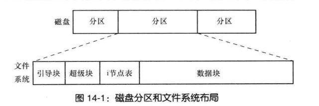
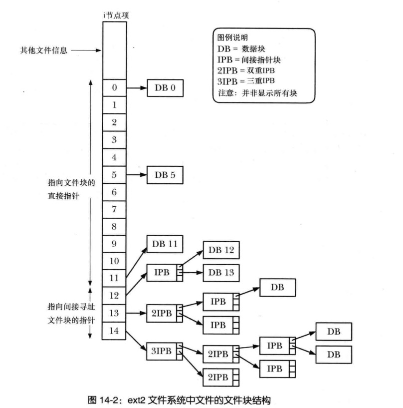

# 第14章系统编程概念
## 14.1 设备专用文件
```
设备文件与系统某个设备相对应
每个设备都有与之设备对应驱动程序(该程序用来处理设备该设备的所有IO请求)
  驱动设备程序提供的API是固定的
  open() close() read() write() mmap() ioctl()
  提供的接口一直,隐藏操作方面的差异,满足IO操作的通用性 


真实物理设备和虚拟设备
  真实的物理设备:鼠标,磁盘,和磁带设备
  虚拟设备:
      不存在该设备,内核通过设备驱动程序提供一种抽象设备


驱动程序提供固定的API,则不管是虚拟设备和真实设备操作都是统一的


设备被划分为两种类型
    字符型设备(基于每个字符出来数据)。终端和键盘都属于该设备
    块设备(每次处理一块(块的大小取决于设备类型)数据)
         通常为512字节倍数

设备文件位于文件系统
    /dev 目录下
    root 和 特权用户可以使用mknod()系统调用创建设备文件

```
### 设备ID
```
主,辅 ID
主ID:
  标识设备等级 内核会根据主ID查找与之设备对应的驱动程序
  note:内核并不会使用文件来查找内核驱动
辅ID:
   主ID设备等级分类里面唯一的ID(必须唯一)

ls -l  查看 主 辅 ID

驱动程序 将字节主 ID 关联 向内核注册

linux2.4 及更早版本,设备总数受限于,主 辅ID 只能用8位数来表示
主ID 固定不变 并且统一分配(Linux命名和编号机构)
```
## 14.2 磁盘和分区
### 磁盘驱动器
```
将磁盘划分为一个或多个(不重叠)分区。内核将每个分区视为/dev 路径下的单独设备


linux 
cat  /proc/partitions
分区 和 设备的主辅设备号码

fdisk  查看 设置磁盘相关

磁盘可容纳的信息
 1.文件系统
 2.数据区域(可为裸设备对其访问 一些数据库管理系统使用该技术)
 3.交换区域 内核和内存之用


mkswap 设置linux的交换区

linux 查看已激活的交换区域设备
  cat /proc/swaps

Filename          Type            Size           Used            Priority
/dev/sdb          partition       4194304       0               -2
```
## 14.3 文件系统
```
文件系统:常规文件和目录的组织集合
mkfs 创建文件系统

linux 支持的文件系统
  ext2 文件系统
  native 的 UNIX 文件系统
  微软 FAT FAT32 NTFS
  ISO 9660 CD-ROM 文件系统
  Apple Macintosh的HFS
  一系列网络文件系统
  日志文件系统
    ext3 ext4....


查看当前内核所知的文件系统类型
cat /proc/filesystems
```
### ext2文件系统
### 文件系统结构

```
空间单位:块
  块大小 1024 ,2048,4096 byte

引导块:
  文件系统的首块
  不为文件系统所用
  引导OS信息(所欲文件系统都设置引导块,但是大多数引导块都未使用)

超级块:
   文件系统相关的参数的存储
   1.i 节点表容量
   2.文件系统逻辑块大小
   3.以逻辑块计,文件系统大小
 
i节点表:
    i 节点条目 --->文件/目录 相关的各种信息

数据块:
    数据的存放

```
### i节点
```
标识:顺序位置
ls -li 
14055 drwxr-xr-x 3 liuxin liuxin  4096 Nov 24 14:33 '$HOME'
14055 i节点号

文件类型
  常规文件 目录 符号连接 字符设备 等
文件属主
    用户ID
文件属组
    用户GID

3类文件的访问权限


3个时间戳
  ls -lu
  文件最后一次访问 
  
  ls -l
  最后一次修改时间
   
   ls -lc
  文件状态的改变时间 
   
   note:
       和 UNIX 一样大多数Linux 不会记录文件创建的时间


文件链接数量

文件的大小,以字节为单位
分配给文件的块数量
指向文件数据块的指针


ls -li
29616 -rw-r--r-- 1 liuxin liuxin   158 May 21 17:20  main.c
inode 节点号码
文件类型和权限
文件link次数
```
### ext2 中的i节点和数据块指针

```
每个inode
   15个指针
   0~11 指针 指向文件前12 块的位置
   12~15
```