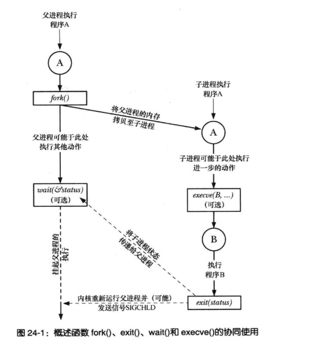
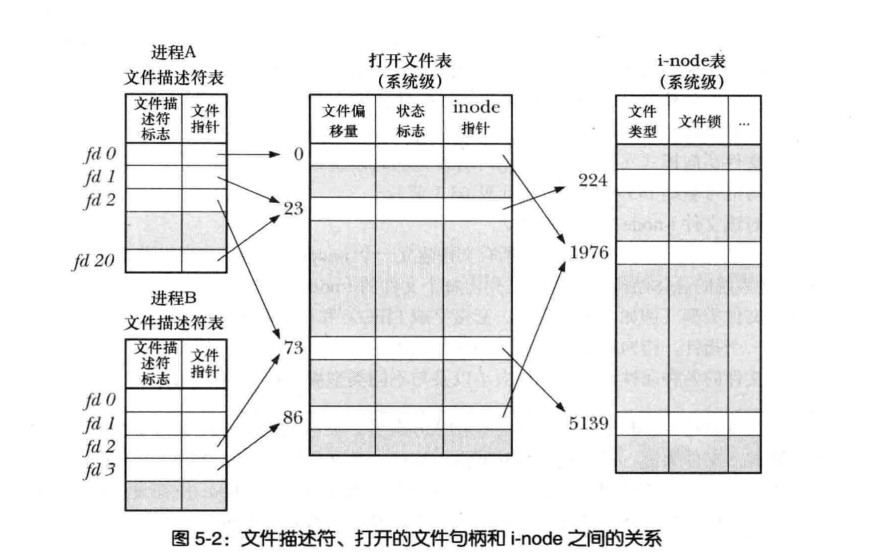
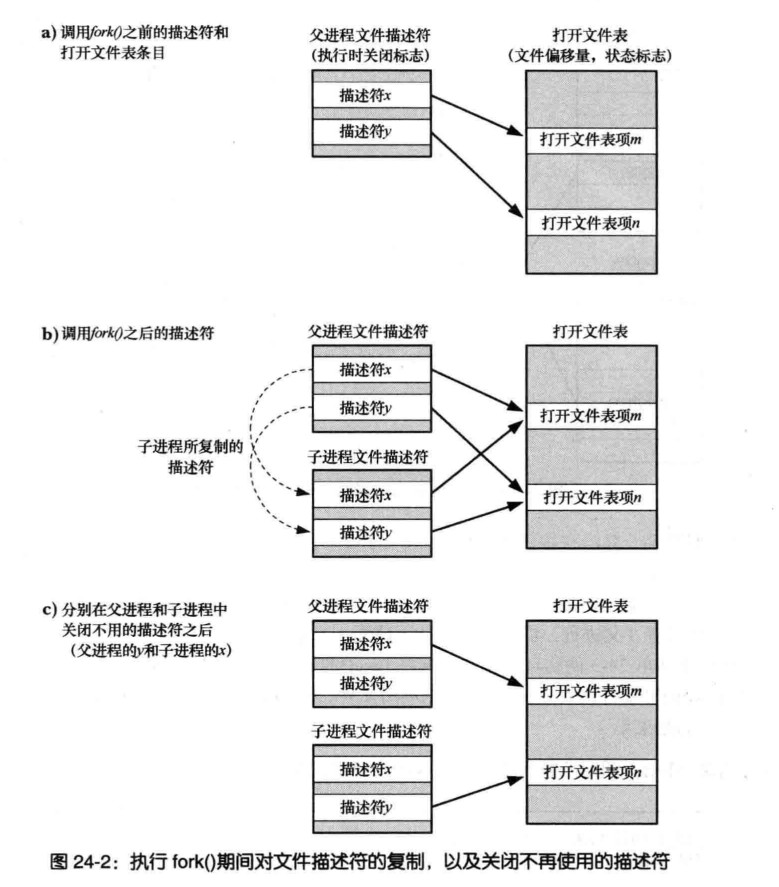

# 24 进程创建
### fork exit wait exece 相互协作总结

```
SIGCHILD(默认情况下会忽略该信号):子进程结束,内核会为父进程产生一条该信号

```
## 24.2 创建新进程:fork()
```c
 #include <sys/types.h>
 #include <unistd.h>
 pid_t fork(void);


note:
   可用通过fork()的返回值来区分父子进程
return -1 error
parent return  pid of child
child return  0


getpid() 子进程可以通过该函数获取自己的id
getppid() 子进程调用getppid() 获取父进程id


note:
  fork() 之后 父子进程的调用顺序是不能确定的(由OS的调度算法决定)

```

### 24.2.1 父,子进程间的文件共享



```
上图描述了文件描述符好的关系图

fork() 子进程会复制父进程的文件描述符表

文件指针指向的打开文件表是子父进程共享的,
  文件偏移量
  文件状态标志
  inode 指针
 上面的三个属性一个进程改变能影响到其他共享文件描述表的进程

read(),write(),lseek() 都会修改文件的打开文件表的偏移量

open(),fcntl()/F_SETFL 会改变文件的状态标志

```
### 24.2.2 fork() 的内存语义
```
fork:
  可以认为子进程拷贝父进程,数据段,堆,进程..
  

Unix(Linux),调用fork() 复制数据做了哪些优化
  1.Kernel 标记为只读,进程无法修改只读段的数据,fork() 的时候kernel 会根据只读代码段对子进程做物理页的映射
  2.父进程的数据集段,堆段,和栈段中的各页。内核采用写的时候复制(copy-on-write)技术处理
     kernel 将这些段物理页映射在子进程,并设置为只读
     如果子进程修改数据kernel会捕获,并将要修改的页创建并赋值到要修改的进程。(从此刻起子父进程各自修改各自的)

```
#### 控制进程的内存需求

## 24.3系统调用vfork()
```c
早期BSD,fork()会对父进程的数据段,堆，栈,施行严格复制,这是一种极大的浪费(尤其是fork之后立即执行exec()函数极大的浪费)


BSD 后期引入了vfork() 系统调用,

现代UNIX采用采用写时复制技术来实现fork(),

note:
  vfork()诡异的语义可能导致,难以觉察的程序缺陷bug。
  除非能给性能带来重大的提升,否则避免使用这一调用


vfork() 是为创建进程后立即执行exec()程序而专门设计的


#include <sys/types.h>
#include <unistd.h>
pid_t vfork(void);

return parent: return child process id,

       -1 on error; 

       in successfulyk created child:always return 0


vfork 和 frok 函数有哪些优势
1.child process 不会复制 parent 数据,知道exec() or 调用 _exit() 结束
2.在子进程调用exec() 或 _exit() 之前,将展厅执行父进程

  由于child process 不会复制parent process 数据 ,他们之间的数据是共享的,
  进程内存任意数据修改,对父进程和子进程都可见


vfork() 调用期间会复制文件描述符表(内核会为每个进程创建一个该表),
所以对文件描述符修改不会造成影响(每个进程文件描述符表是独立的)


vfork() 
  系统保证vfork() 之后 child process 优先语 parent process 调用


note:
    除非速度绝对重要的场合下,新程序应当舍vfork()而取fork()

    fork() 现代Unix 系统 和 Linux 都使用写时拷贝,性能得到很大的提高

   
   vfork 如何使用

   switch(pid=vfork()){
    case:-1;
      break

    case:0;
      (exec()<0){ // 在exit调用失败立即执行_exit()
        _exit(); //note: 不能调用 exit()
      }
     break;
    default:
     break;
   }
     
  

  exit():
    会导致父进程的stdio 缓冲区刷新和关闭

  2.vfork() 依赖系统调用顺序,内存共享,程序移植会造成很大的问题

```
## 24.4 之后的竞争条件
```

fork() 之后不能确定子父进程的调度顺序(note:不同的内核调度顺序是不一样的)

note:
  Linux 2.6.32 开始 fork()之后父进程称为了率先调用的对象。
  /pro/sys/kernel/sched_child_runs_first 设置为非0 ,改变默认默认先调用符进程

```

## 24.5 同步信号规避竞争条件
```

```