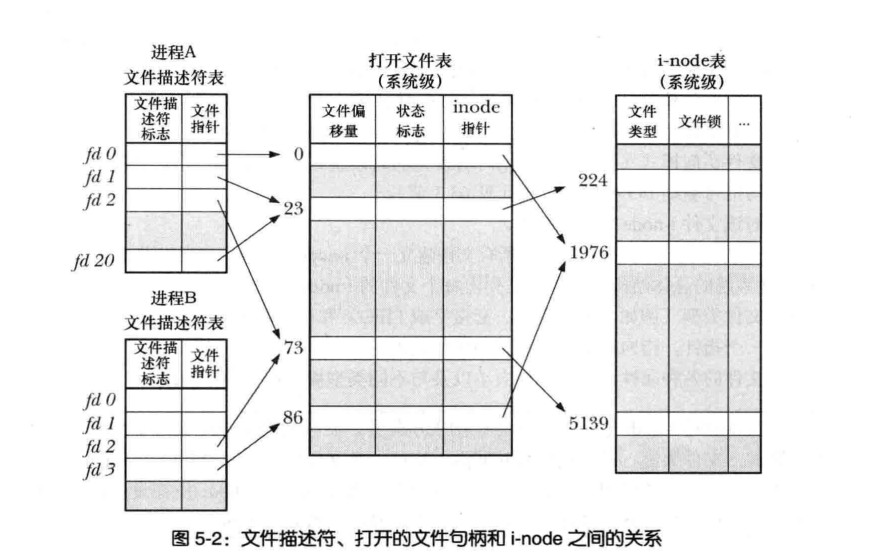

# 深入探究文件IO
## 原子操作和竞争条件
```
内核保证了某系统调用中的所有步骤会作为独立操作二一次性加以执行,其间不会为其他经常或线程所中断

```
### 一独占的方式创建一个文件
```
O_EXCL 是一个用于确保文件唯一性的重要参数

O_EXCL 和 O_CREAT 一起使用 只有文件不存在的时候才会创建,
note: 当文件已经存在会返回错误
```

```
上面的文件潜伏了一个bug

第一次调用open,希望打开的文件还不存在。
第二次调用open,其他进程已经创建了该文件。


出现问题原因:
  1.单CPU ,当执行第二次open 还没有开始的时候,进程A时间片段使用完了,OS将CPU的使用权交给B进程
  2.多核CPU,AB进程同时执行上面的代码。进程A将会得到错误的结论(目标文件是自己创建的),无论目标文件是否存在进程A都会在第二次调用成功


解决方式
  O_CREATE|O_EXCL 一起使用原子创建判断

```
### 向文件尾部追加数据
```c
多个进程同时向同一个文件尾部添加数据

code1:
if(lseek(fd,0,SEEK_END)==-1){
    errExit("lseek");
}

if(write(fd,buf,len)!=len){
    fatal("Partial/failed write");
}

后一个调度的进程写入数据会覆盖前一个进程写入的数据

解决方式
open(fd,O_APPEND,...) 
  文件写入和将文件偏移设置在最后纳入同一原子操作


note:
  游戏文件系统(例如NFS)不支持O_APPEND标志。
  不支持这种操作的文件系统OS会使用 lseek(fd,0,SET_END) write 操作写入

```
## 5.2 文件控制操作
```c
// 对文件描述符号进行操作
#include <unistd.h>
#include <fcntl.h>
int fcntl(int fd, int cmd, ... /* arg */ );

return -1 error

```
### 5.3打开文件的状态标志
```C
flags=fcntl(fd,F_GETFL);

if(flags==-1){
    errExit("fcntl")
}

if(flags&O_SYNC){
    print("write are synchronized\n")
}


note:
  SUSV3 只有open 和 fntl的F_SETFL 才能对文件转改标志进行设置
  linux的实现与上面SUSV3有所偏离


文件的访问模式判断
  O_RDONLY
  O_WRONLY
  O_RDWR
  
  accessMode=flags&O_ACCMODE;
  if(accessMode==O_WRONLY||accessMode==o_RDWR){
    print("file is writable\n")
  }


linux F_SETFL 允许修改
O_APPEND,  O_ASYNC,O_DIRECT, O_NOATIME, and O_NONBLOCK  
其他的状态都会被忽略


fcntl 修改修改文件标志适用场景
   1.fd 不是 由 call process open 的所以无法使用open来控制文件的状态标志
      (例如:标准输入在进程执行前就被启动了)
   2.fd 获取是通过非open获取
        (例如pipe创建管道返回两个fd,socket 调用)


code 
int flags;
flags=fcntl(fd,F_GETFL);
if(flags==-1){
    errExit("fcntl")
}

flags|=O_APPEND;//每次写入原子的将pos 移动end,并且写入
if(fcntl(fd,F_SETFL,flags)==-1){
    errExit("fcntl")
}
```
## 5.4文件描述符号和打开文件之间的关系
```
内核维护3个数据结构
1.进程级的文件描述符表
    记录信息
    fd:
      控制文件操作的一组标志(目前此类标志只定义了一个,即close-on-exec)
      打开文件的句柄引用

2.系统级打开文件表
    存储了每个打开文件的全部信息
    1.file offset (read,write 使用完后更新,lseek直接修改)
    2.打开文件使用的状态标志(open()的flags参数)
    3.文件的访问模式
       O_RDONLY O_WRONLY O_RDWR
    4.与信号驱动相关的设置(63.3节)
    5.i-node指针
3.文件系统的i-node表(14章详细介绍)
    1.文件类型(常规文件,套接字或FIFO)和访问权限
    2.一个指针,指向该文件所持有的锁的列表
    3.文件的各种属性(文件的大小,不同的类型操作相关的时间戳)

note:
   访问一个文件的时候会在,会在内存里面创建一个inode副本
   inode副本包含信息
         应用该副本的数量
         inode 所在的主从设备号码

```


```c
根据上图
进程A
   fd_1和fd_20执行同一个打开文件句柄表条目
   出现fd_1和fd_20指向同一个打开表条目,有哪些可能
   dup dup2 fcntl 而形成


进程A  fd_2 和 进程 B fd_2 执行同一个打开文件句柄条目
  1.fork() 子进程会复制父亲进程的内存包括进程级文件描述符表
  2.UNIX域套接字将一个打开的文件描述符传递给另一个进程
  
  共享offset


进程A fd_0 和 进程B fd_3 指向不同的文件打开句柄条目但是文件打开句柄表指向同一个inode
   进程A和进程B分别向统一path的文件open()
   不同的文件描述表条目维护不同 offset 状态等信息


note:
  A fd_2 和 A fd_20 指向同一打开文件句柄
  共享 offset 
  fd_2 or fd_20  read write lseek 导致 offset改变对fd_2 和 fd_20 都是可间的
   
  无论是同一个进程or不是同一个进程都是能观察到上面说的变化

  
  fcntl F_SETFL 设置fd状态,对任意文件描述符号指向该系统系统打开句柄描述表都有相同的限制
   

 进程文件描述符号表是每个进程私有的,对该表上内容的修改不会影响其他进程的内容
    
```
## 5.5复制文件描述符号
```c
#include <unistd.h>
1.int dup(int oldfd);
  赋值一个open 的 oldfd,并返回new fd,
  note:
    系统保证返回的newfd 是系统未使用最小值的文件描述符号


  code:
      如果希望返回fd 2可以使用以下技术
      close(2)
      newfd=dup(1)  

2.int dup2(int oldfd, int newfd);
    oldfd 创建指定文件描述符号(newfd)的副本
    note:
       newfd 指定的描述符号若果已经打开 会先执行close(newfd)
       dup2 会默默的忽略close(newfd)的错误,安全的做法 newfd 如果已经打开 先显示的关闭
       oldfd 并非有效文件描述符号返回错误EBADF

       newfd==oldfd 什么事情也不做


 
3.newfd=fcntl(fd,F_DUPFD,startfd)
   返回大于等于startfd 的描述符编号

   fcntl 能改成

   dup2
   if(newfd==-1){
     return;
   } 
    close(newfd)
   newfd=fcntl(fd,F_DUPFD,newfd)
    -------------------
   newfd= dup(fd)
     ==
    newfd=fcntl(fd,F_DUPFD,0)


     note: 虽然fcntl 能改成dup dup2 但是需要注意的时候
        返回的错误码存在一些差异


   newfd=fcntl(fd,F_DUPFD_CLOEXEC,startfd)
        F_DUPFD_CLOEXEC 为newfd设置 close-on-exec 状态
        SUSv3 并为论及 F_DUPFD_CLOEXEC 
        SUSv4 对其做了规范


dup dup2 fcntl 复制的newfd 有其自己的一套文件描述标志
     close-on-exec 标志 (FD_CLOEXEC) 总是处于关闭状态


4.
linux 2.6.27 linux特有
#define _GNU_SOURCE             /* See feature_test_macros(7) */
#include <fcntl.h>              /* Obtain O_* constant definitions */
#include <unistd.h>
int dup3(int oldfd, int newfd, int flags);
  基本功能和dup2一样,flags可以修改系统行为的位掩码

    当前dup3 flags只支持 O_CLOEXEC

```
## 5.6 在特定偏移处的IO:pread() 和 pwrite()
```c
#include <unistd.h>
ssize_t pread(int fd, void *buf, size_t count, off_t offset);

    return 读取的的字节数量, 0 EOF,-1 错误
ssize_t pwrite(int fd, const void *buf, size_t count, off_t offset);
    return 写入的字节数量,-1 错误


pread() 相当于
   off_r off;
   off=lseek(fd,0,SEEK_CUR) //获取当前文件position
   lseek(fd,offset,SEEK_SET) // pread 从 文件开始处 offset开始读取 
   s=read(fd,buf,len)
   lseek(fd,off,SEEK_SET)//由于 pread 不会设置 positon 所有执行完需要postion 恢复原处


note:
  pread 和 pwrite 使用的fd必须要lseek操作的
    
```
## 5.7 分散输入和集中输出readv()和writev()

```c
PSIS
#include <sys/uio.h>
ssize_t readv(int fd, const struct iovec *iov, int iovcnt);
ssize_t writev(int fd, const struct iovec *iov, int iovcnt);


一次可以传入多个缓冲区数据
iovec 定义传输数据的缓冲区
<limit.h> IOV_MAX or sysconf(_SC_IOV_MAX) 获取iov成员的限制
struct iovec {
    void  *iov_base;    /* Starting address */
    size_t iov_len;     /* Number of bytes to transfer */
};

SUSv3 限制不得少于是16
Linux 将IOV_MAX定义为1024。


glibc 对 readv() 和writev()的函数做了一些额外的操作
系统调用iovcnt 参数过大而调用失败,外壳砍杀将分配一块缓冲区域,其大小可以容纳iov参数所有可描述的缓冲区。随后子啊执行read 或write 调用
```
### 分散输入
[readv.c](../codes/readv.c)
```c
原子性操作
readv
ssize_t readv(int fd, const struct iovec *iov, int iovcnt);

note:
  readv 成功返回字节数
  如果数据大于缓冲区域,则只会占用部分缓冲区,其中最后一个缓冲缓冲区只能存储部分数据

```
### 集中输出
```c
原子操作
writev() 集中输出,将iov所指定的所有缓冲区中读数据集中拼接
ssize_t writev(int fd, const struct iovec *iov, int iovcnt);

writev() 也存在部分写入的问题
返回值小于传入长度

```
### 在指定的文件偏移处执行分散输入/集中输出
```c
#define _BSD_SOURCE
#include <sys/uio.h>
ssize_t preadv(int fd, const struct iovec *iov, int iovcnt,off_t offset);
ssize_t pwritev(int fd, const struct iovec *iov, int iovcnt,off_t offset);

Linux 2.6.30 新增,并非标准系统调用但是获得了现代BSD的支持

Since glibc 2.19:
_DEFAULT_SOURCE
Glibc 2.19 and earlier:
_BSD_SOURCE

原子操作 并且能够指定offset
```

## 5.8 阶段文件
```c
#include <unistd.h>
#include <sys/types.h>
int truncate(const char *path, off_t length);
需要有写权限, 

int ftruncate(int fd, off_t length);
需要有写权限,
执行完不会改变offset


文件大于length将丢弃超出部分
文件小于length将文件尾部添加空字符串或是一个文件空洞


note:
  ftruncate
  lenght 超出当前文件大小SUSv3允许两种行为 
     要么扩展该文件(如Linux),要么返回错误
  
    XSI 标展
       采用扩展文件
 


  truncate SUSv3 要求总是能扩展
```

## 5.9 非阻塞IO
```c
open()  O_NONBLOCK

不能立即打开 返回错误 ,非陷入阻塞
note:
   open() O_NONBLOCK 操作FIFO 会陷入阻塞


管道 FIFO 套接字都支持非阻塞模式(终端,伪终端)


```
## 5.10 大文件I/O
```
32体系架构
 limit:2^31-1(2GB)


linux2.4 32bits linux 也开始提供对LFS的支持(glibc>=2.2)
note:
  需要文件系统也支持大文件的操作


推荐使用
_FILE_OFFSET_BITS 定义为64.


```
## 5.11 /dev/fd 目录
```
/dev/fd/n
/dev/fd/0 标准输入


```