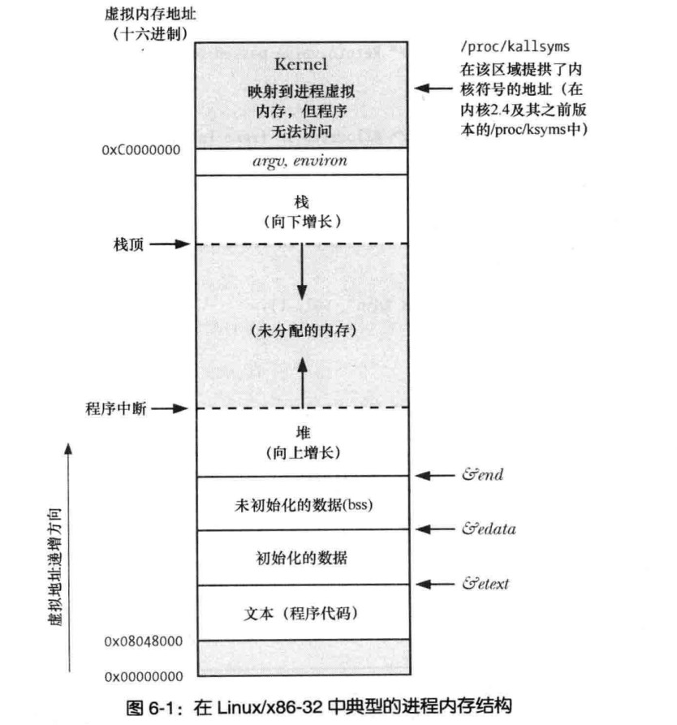
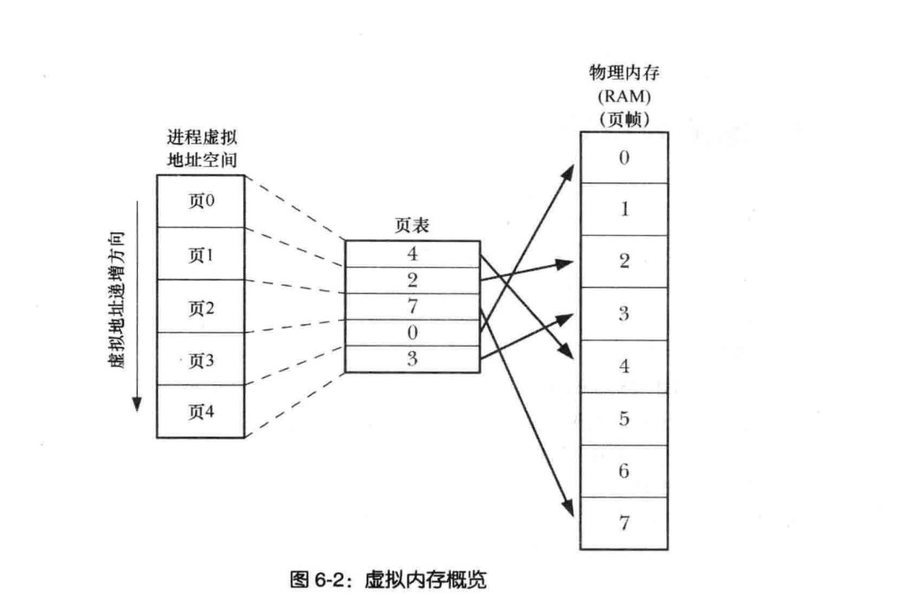

# 进程
```c
cat /proc/sys/kernel/pid_max 
查看设置最大进程号码


#include <sys/types.h>
#include <unistd.h>
pid_t getpid(void);
pid_t getppid(void);


进程号 1 是进程的始祖先


/proc/pid/status

Pid:    122224
PPid:   1

```
## 进程的内存布局
```c
文本段:机器指令 只读
初始化数据段:全局变量，静态变量
未初始化数据段:未初始化的全局变量和静态变量 
   加载进入内存将该区域所有数据都初始化为0
   BSS
   没必要再磁盘上分片空间存储,只记录位置和大小

栈(stack):
    函数局部变量,函数实参和返回值
堆(Heap):


size:显示二进制可执行代码各个段的大小
size xx

   text    data     bss     dec     hex filename
   2440     648       8    3096     c18 readv


#include <stdio.h>
// c语言全局符号
extern char etext, edata, end;

int main()
{

    printf("etext:%p\n", &etext); // 文本段 下一个字节
    printf("edata:%p\n", &edata);//初始化数据下一个字节
    printf("end:%p\n", &end);//非初始化结尾处的段下一个字节
    return 0;
}

```

```
上图指定etext,edata,end的位置
```

## 虚拟内存
```
虚拟内存
  每个程序的内存切割成小型固定大小的页(page)
   RAM 将划分为一系列与虚拟内存也尺寸大小相同的页帧

每个程序仅有部分也需要驻留在物理内存页帧中
程序未使用的页会被拷贝的交换区
当需要使用swap 去的页才会把他加载到内存


note:
   当访问到未在内存的的数据的到时候,发生页错误(page fault),内核挂起进程,内核将磁盘中的页载入内存,恢复用户进程执行


内核需要为每个进程维护一张页表
  每条数据
     当前页 是否在物理内存中
     虚拟页和物理也位置的映射关系

  并非所有的页表范围都需要页表条目。若存在大端的虚拟地址空间并未投入使用,故而没有必要维护相对应的条目。若进程试图访问这些不存在页表的内存，进程会收到SIGSEGV信息


内核可以为进程分配和释放页
  1.栈向下超出之前到达的位置
  2.对分配或释放内存 brk sbrk malloc
  3.调用shmat() 连接System V 共享内存区域,调用shmdt()脱离贡献内存区
  4.mmap创建映射 munmap 解除内存映射 

```

```
不同进程共享
  每个进程的页表条目指向映射到相同的物理内存

   examples:
     1.同一程序代码相关的页表条目指向同一个物理页(共享代码副本)
     2.shmget() mmap() 系统调用显示地请求与其他进程共享内存区域
         用于进程间通信


内存保护机制(权限)

编译器,链接器无需关注程序在RAM的物理内存

```
## 栈和栈帧
```
内核栈：
   系统调用过程中，供内核函数调用使用
```
## 命令行参数(argc,argv)
```c
argv char*[] 数组其实是以NUll结尾

char **p
while(*p!=null){
   

   p++;
}


/etc/pid/cmd 访问命令行参数

argv 和 environ 数组 都是停留在进程栈之上的一个单一连续的内存区域


getopt library 解析传入参数

```
## 环境列表
```
新进程创建之前会继承父进程的环境副本
父子进程在运行的时候修改的环境的变量只对自己可见


printenv 答应当前列表的环境变量


/proc/PID/environ 检查进程的环境变量
```
### 从程序中访问环境

```c
extern char **environ;

*environ==NULL表示已经终止了

environ 和  printenv 输出的结果相同


note: 下面main的这种形式普遍Unix实现但是不是
      c语言标准,有点编译器OS不支持
main(int argc,char *argv[],char *env[])

       #include <stdlib.h>

       char *getenv(const char *name);

return NULL 不存在没有匹配的


```
### 修改环境
```c
       #include <stdlib.h>

       int putenv(char *string);


return  0 success 非  0  失败


string  是  key=value 形式的字符串
string 指针 分配的内存地址不应该在栈上


#include <stdlib.h>
int setenv(const char *name, const char *value, int overwrite);

return 0  succ  -1 error 


int unsetenv(const char *name);
移除

return 0  succ  -1 error 


note:
  setenv ，unsetenv
  均来自BSD
  putenv SUSv3 将其纳入规范


        #include <stdlib.h>

       int clearenv(void); 
      
        等同于

        environ=NULL


note:
clearenv(void)  不会释放内存区域
一般使用:(不要在进程里面多次执行 会内存泄露)
   只会在程序启动的时候调用一次clearenv,移除父进程的环境变量继承
    
  许多UNIX都支持 clearenv  该函数SUSv3 并没有对该函数进行规范，


  启动 clearenv
  environ为 NULL,

  putenv or  setenv 发现 environ 为NULL
  会创建一个新的环境列表


```
##  执行费局部跳转:setjmp 和 longjmp
```c
#include <setjmp.h>


goto 跳跃范围局部跳转
setjmp 和 longjmp 当前执行函数之外的地方

setjmp  设立跳转目标（setjmp 的跳转位置）


setjmp()
  return 0 第一次返回  非0 longjmp(env,val) 是 val 值

  note:
     通过 setjmp() 返回的不同值可以区分同步的longjmp() 位置
     
      longjmp(env,0)
          val 设置为0 longjmp 为了使setjmp() 第一次返回值区分会将0替换为1


setjmp():
   env 储存当前线程的信息，保存程序计数寄存器(PC)
   栈指针寄存器


longjmp():
   1.longjmp() 将当前的栈指针值换为env(setjmp(env))的对应的值
   2.PC寄存器重置成setjmp()位置保存的值的PC


code:

#include <setjmp.h>
#include <stdio.h>

static jmp_buf env;

static void f2()
{
    longjmp(env, 2);
}

static void f1(int argc)
{
    if (argc == 1)
        longjmp(env, 1);

    f2();
}

int main(int argc, char *argv)
{

    switch (setjmp(env))
    {
    case 0:
        printf("Calling f1() after initial setjmp() \n");
        f1(argc);
        break;

    case 1:
        printf("We jumped back from f1()\n");
        break;

    case 2:
        printf("We jumped back from f2()\n");
        break;
    }

    return 0;
}
```
### 对setjmp()函数的使用限制
```
setjmp(env) 
    env 无法保证足够多的信息到env(所有的寄存器数据,封闭表达式,临时栈位置)

   s=setjmp(env)
     s 是临时变量,s存入栈帧,longjmp() setJmp() 返回的数据存入栈非常危险

```
### 滥用longjmp()
```c
1.
static jmp_buf env;

void x(){
  setjmp(env);
}

void y(){
  longjmp(env,val);// x已经执行完 x的栈帧销毁 
      // 幸运的话程序会crash
      // 不幸会死循环
}

main(){
  x();
  y(); 
}


2.多线程滥用
  线程1 setjmp(env)
  线程2 longjmp(env,val)
```

### 优化编译器的问题
```c
编译器优化会重组指令的排序
setjmp()  和  longjmp() 会在执行时期才能确立和执行
note:
  编译器不能将setjmp() 和  longjmp() 情况考虑在内
  若编译器优化重排序和CPU pipe 重排序 
  setjmp() 会保存 CPU 寄存器副本是错误的


#include <setjmp.h>
#include <stdio.h>

static jmp_buf env;

static void doJump(int nvar, int rvar, int vvar)
{
    printf("Inside doJump():nvar:%d,rvar:%d,vvar:%d\n", nvar, rvar, vvar);
    longjmp(env, 1);
}

int main(int argc, char *argv)
{

    int nvar;
    register int rvar; // 建议在计算器上存储
    volatile int vvar;
    nvar = 111;
    rvar = 222;
    vvar = 333;
    if (setjmp(env) == 0)
    {
        nvar = 777;
        rvar = 888;
        vvar = 999;
        doJump(nvar, rvar, vvar);
    }
    else
    {
        printf("After longjmp():nvar:%d,rvar:%d,vvar:%d\n", nvar, rvar, vvar);
    }

    return 0;
}


gcc -O 优化变异

// 
Inside doJump():nvar:777,rvar:888,vvar:999
After longjmp():nvar:111,rvar:222,vvar:999

volatile  告诉编译器不要优化避免代码重组


note:
   不同的编译器优化不同,如果需要代码有良好的移植性。需要将所有的局部变量都声明成volatile

```
### 尽可能避免使用setjmp()和longjmp()函数
```

```

