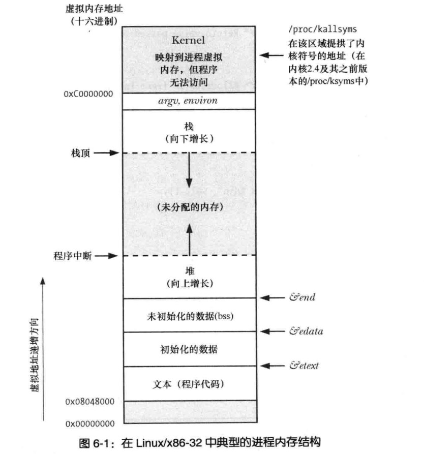
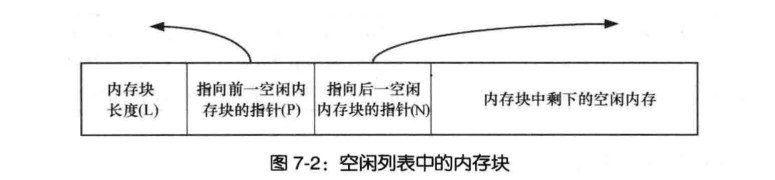

# 内存分配
```
介绍在堆和栈上分配的函数
```
## 7.1 在堆上分配内存
```
堆当前内存边界被称为 program break
```
### 7.1.1 调整 program break: brk() 和 sbrk()

```c
改变堆的大小(分配和释放)

最开始program break 的位置在上面 图片 未初始化数据.bss 位置的末尾,

porgram break 位置抬升后,程序可以访问新分配区域内的任何内存地址,
此时物理内存页尚未分配。进程首次访问这些新分配的虚拟内存地址会自动分配新的物理内存页


传统的Unix提供两个操纵 program break 系统调用 brk() 和 sbrk()

       #include <unistd.h>

       int brk(void *addr);


       return 0 success,-1 error
              brk(addr)
                 将 program break 设定到指定的位置
                 note:
                    内存是以页为单位,实际上执行位置如果不满足刚好分配到页的结尾位置,则会四舍五入到下一个内存页的结尾


       note:
          如果指定addr 位置为初始的program break(.bss结尾) 可能会导致无法预知的行为
       


       void *sbrk(intptr_t increment);

       return -1 error, 返回增加后的新地址                          


              sbrk( increment)
                  在原地址(program break)上增加 increment 大小并且返回地址


              note:
                 linux 中sbrk(increment) 是在brk(addr)的基础上实现的库函数


sbrk(0) 返回当前的地址
可以跟踪当前堆program break 的位置,可以根据位置判断当前堆的大小
note:
  监测内存分配函数包的行为可能会用到这一用法

```
### 7.1.2 在堆上分配内存:malloc()和 free()
```c
malloc和free
1.c语言标准函数( #include <stdlib.h>)
2.线程安全
3.接口简单,允许分配小块内存
4.内部维护一张空闲的内存表,用于循环重复利用


       #include <stdlib.h>

       void *malloc(size_t size);
       void free(void *ptr);


note:
       malloc()返回内存地址采用的是直接对齐的方式
       在大多硬件架构,malloc是基于8字节或16字节边界来分配的内存


      SUSv3规定 malloc(0)
        1.可以返回NULL
        2.可以返回一小块可以free()掉的内存

        linux 遵循第二中方式,malloc(0) 分配一小块可以free()掉的内存


malloc() 无法分配
  1.program break 到达地址的上限
      malloc(size) 返回NULL
      并设置错误信息(errno)


  note:
    虽然malloc() 返回NULL 错误的几率很小,但是还是必须在程序中进行错误检查


#include <stdlib.h>
void free(void *ptr);
note:
   一般情况下,free()并不降低program break 的位置
   会将这块地址添加空闲内存列表中。可以使malloc() 来使用

 
为什么free()一般不会降低program break 位置
       1.free() 可能释放的堆中间的位置的内存,非顶部内存
       2.最大限度的减少sbrk()调用次数(sbrk()系统调用)
       

free(NULL) 函数什么也不会做,不会设置错误代码


free() glibc实现会将相邻的两块空闲内存合并成一整块更大的内存(避免空闲内存列表中包含大量小内存碎片)


note:
   仅当堆顶空闲内存"足够"大的时候会调用sbrk()来降低program break 的地址     
  "足够" 取决于malloc函数包的控制参数(128k为典型值)

```
### 调用free还是不调用free
```
1.对于分配内存知道程序终止前持续使用的内存可以不用free
     程序在终止的时候OS会将所有内存回收

建议显示的调用free()释放内存
2.显示调用free() 能使程序在未来的修改更加具有刻度性和可维护性
3.malloc() 库查找内存泄漏,未经过显示的free()会被判定为内存泄漏,
       会使发现真正的内存泄漏的工作复杂化
```
### 7.1.3 malloc() 和 free()的实现
**malloc返回的内存块**

```c
malloc 实现
       1.扫描free() 释放的空闲内存列表
       2.找到尺寸大于或等于的空闲内存
              大于 分割返回
              等于 直接返回
       3.如果找不到大于或等于malloc size 的内存空间会
          调用sbrk() 增加program break 一般会分配内存页的数倍大小
          会分割size大小用于返回,剩余部分的空间防止空闲列表


free()
       malloc(size) info size + size 
       

       info size 大小的内存存放
              1.malloc 实际分配内存块大小


malloc() 返回的地址是存储内容的地址
实际其实地址 =存储内容地址-info size 空间大小

```
**空闲列表内存块**

```c
数据结构双向链表

Node 
[内存块长度L][指向前一空闲的内存的指针P][指向后一空闲内存块的指针N][内存中剩下的空闲内存]
```
**包含以分配内存和空闲内存列表的堆**

```
note:
  随着对内存不断的释放和重新分配,空闲列表中的空闲内存 会和已分配的在内存中混杂在一起


  1.释放完了free(ptr),将 ptr=NULL,防止多次free()同一地址
  2.free(ptr),ptr 必须是由malloc(ptr)分配的内存;
  3.如果该程序需要长时间运行,在需要释放掉哪些已经使用完的内存,避免内存泄漏
    
```
### malloc调试的工具和库
```c
mtrace() 开启内存分配跟踪
       处于安全考虑,可以设置用户ID 或则 组ID来忽略对mtrace()的调用
muntrace() 关闭内存跟踪
MALLOC_TRACE 环境变量设置

如果程序在分配之外的地方写入会捕获这个错误
mcheck()
mprobe()
cc -lmcheck 需要链接mcheck库

```
### 7.1.4 堆上分配内存的其他方法
```c
       #include <stdlib.h>

       void *calloc(size_t nmemb, size_t size);

           calloc 会将分配的内存初始化为0

       void *realloc(void *ptr, size_t size);
         ptr 之前是由malloc 分配

         realloc() 调整大小分配 
           note:
             返回内存地址可能与之前不同
           
           return 返回NULL 重新分配发生错误,不会对ptr执行的内存区域块做任何操作
             


calloc() 和 realloc() 分配的内存都是由free()来释放


realloc()
       1.试图合并在空闲列表中紧随其后且大小满足的内存块
       2.realloc(ptr,size)
          ptr 在堆顶部会将堆空间扩展
       3.ptr 在堆中部,且紧邻其后的空闲内存空间大小不足。
              3.1realloc会分配一块新内存,
              3.2将原来区域的数据复制到新内存

              realloc 避免使用 3.2 这种情况是大部分的情况


nptr=realloc(ptr,newSize) // nptr 临时变量避免分配失败 覆盖 ptr
if(nptr==NULL){
       //error handle
}else{
    ptr=nptr;
}

```
### 分配对齐内存
```c

       #include <malloc.h>
       void *memalign(size_t alignment, size_t size);


alignment:
       其实地刺是alignment的整数倍,而alignment必须是2的整数次幂


note:
   并非所有的UNIX都存在


       #include <stdlib.h>
       int posix_memalign(void **memptr, size_t alignment, size_t size);
 

   memptr 地址返回地址

       sizeof(void *) 4 or 8
       alignnment 值 必须是 sizeof(void) 域2的整数次幂乘积的值


       size
           sizeof(void *) ==4
             

  note:
    posix_memalign() 出现错误不是返回-1 而是直接返回错误号
    return 0 success

   
note: 由memalign() 和 posix_memalign() 分配的内存块有free() 释放
```
## 7.2 堆栈上分配内存
```c
       #include <alloca.h>
       void *alloca(size_t size);

增加栈帧大小
note:
  分配的栈帧指针 不能使用 free 释放


void *y;
y=alloca(size);//编译器将alloca 作为内联代码处理通过
//调整栈指针来实现

func(x,y,z)


优点;
  随着栈帧的移除而自动释放
  

```

