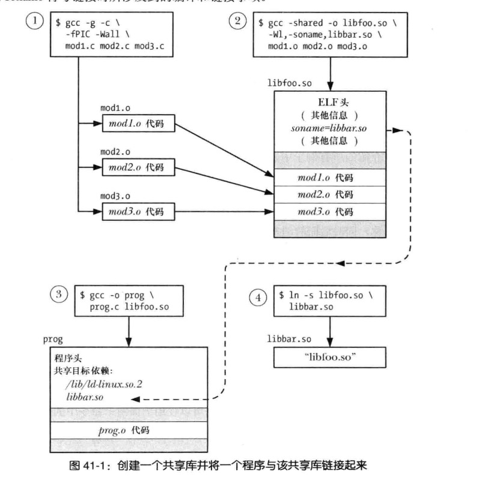

# 41共享库基础
## 41.1目标库
```
 对象库分类:
    1.静态
    2.共享

```
## 41.2 静态库
```
好处:
1·将一组常被用到的目标文件编译成单个库文件,在构建多个应用程序的时候,这些编译成静态库文件的内容不用重新编译,只需要链接即可
```
### 创建和维护静态库
```c
ar options archive object-file......


options
   操作码


r:
  创建和更新文档的标准方法

    ar r xxx.a xxx1.o xxx2.o

t:
   列出archive 目录表

  tv:  列出 archive 目录表的详细信息

d:
  从archive 删除模块

```
### 使用静态库
```
连接静态库
gcc -g -o xx.out xxx.o xxxx.a


-l 会去链接 libxxx.a 
gcc -o xx.out  -lxxx xxx.o

note:
   默认会到 /usr/lib 目录下去搜索 libxxx.a

   gcc -o xxx.out -lxxx xxx.o -L 指令静态库的目录


  xxx.a 里面包含很多模块,注意: 连接的时候只会连接哪些目标文件需要的模块
```
## 41.3 共享库概述
```
静态库缺点:
   多个文件连接静态库,每个文件都包含一个静态库的副本
   1.多个副本狼给磁盘空间
   2.多个包含同一个静态库的可执行文件同一期间执行，每个进程保留同一份代码在内存,浪费内存空间
   3.如果静态库里面的文件修改,则需要把所有使用该静态库的的目标文件重新链接生成


共享库的发明解决的问题:
    单个副本在内存,由多个进程共享程序副本(由第一个使用共享库的内存加载)

note:
    共享库只有代码共享,包含在共享库里面的全局变量是每个进程私有的

共享库的优势:


1.使用位置独立的代码
2.在运行的时候要执行符号重定位.
```
## 41.4 创建和使用共享库-首回合
### 41.4.1 创建一个共享库
```


将x1.c x2.c  x3.c 三个模块放入共享库中

gcc -fPIC -Wall x1.c x2.c x3.c


创建一个包含三个模块的共享库
gcc -shared -o x1.so x2.o x3.o

```
### 41.4.2 位置独立代码
```
cc -fPIC 
  -fPIC 指定编译器生成位置独立的代码
  使编译器生成执行特定操作的代码的方式( 全局 静态  外部变量  访问字符串常量 获取函数地址) 

        使得上面的这些操作变更在程序的执行的时候 上面的这些内容可以放在任意虚拟地址


可以通过下面的两种方式来判断编译的时候是否添加-fPIC


nm xxx.o | grep _GLOBAL_OFFSET_TABLE    
readelf -s xxx.o  | grep _GLOBAL_OFFSET_TABLE    


objdump --all-headers libfoo.so | grep TEXTREL
readelf -d libfoo.so | grep TEXTREL

note:
   上面两个等价命令中任意一个产生和任何输出,那么指定的共享库中至少存在一个目标模块在编译时没有指定-fPIC选项
```
### 41.4.3 使用一个共享库
```
使用共享库需要先做两件事:
1.执行程序必须通过某种机制找到运行的时候所需的共享库
  note:
    在链接的阶段将共享库名字嵌入可执行文件

2.运行的时候需要通过某种机制解析嵌入的库名
   note:
      动态链接器完成解析工作


gcc -g -Wall -o prog prog.c libfoo.so


ld-linux.so 解析流程
1.先到共享库标准目录查找
  /usr/lib  or  /lib 


note:
  有一些架构同时支持64 bits 和 32 bit
   动态链接库标准目录分别是:
      */lib
      */lib64


```
### LD_LIBRARY_PATH 
```
告诉 动态连接器非标准共享库的位置
  

note:
  如果定义LD_LIBRARY_PATH 会先查找定义目录的位置 
  在到标准目录查找

```
### 静态连接和动态链接的比较
### 41.4.4 共享库soname
```

  gcc -shared -Wl , -soname,libar.so -o libfoo.so xx.o
   xxx.o


-Wl,-soname libar.so 
libfoo.so 的 soname 设置为 libar.so


soname 有什么用:
   提供一层间接,使得可执行程序在运行的时使用与链接时使用的库不同的(但是兼容的)共享库


怎样确定 xx.so 有SONAME 属性
objdump -p libfoo.so | grep SONAME
readelf -d libfoo.so | grep SONAME  


soname 用法 
  
  1.和原来一样使用方式
    gcc -Wall -o prog prog.c libfoo.so 
  2.note: libfoo  包含 soname libar.so
   将 libfoo 和 libar 嵌入到可执行文件 prog
  


note:
  使用 soname libar.so 必须
  ln -s libfoo.so libar.so
  LD_LIBRARY_PATH=  .  ./prog

```
**创建一个共享库并将程序与该共享库连接起来**
 

**加载共享库的程序的执行**


## 41.5 使用共享库有用的工具
```

```