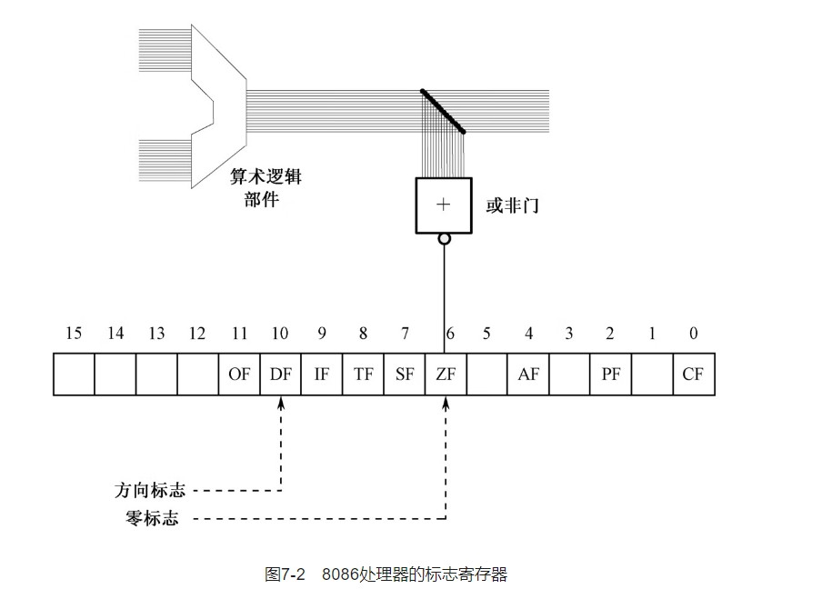

# 相同的功能不同的代码
```
学习目标:
  1.另一种分段方式访问分段内存机制
  2.两种非顺序的的流程控制方法
    2.1循环
    2.2条件转移
 
  3.新指令认识
    movsb movsw inc dec cld std div neg cbw cwd sub idiv jcxz cmp 等

 4.INTEL 8086  FLAGS 的标志位 

 5.认识计算机中的负数

 6.Bochs 调试的更多技巧(查看FLAGS寄存器的格个标志的状态....)

```
## 7.1 代码清单
[c07_mbr](./c07_mbr.asm)

## 7.2 跳过非指令数据区
## 7.3 在数据声明中使用字面值
```
1.nasm  中\ 符号可以作为续行符,当一行写不下时可以在行尾使用 \ 符号 表示下一行的内容和我门这一行合并为一行


 message db '1+2+3+...+100=' ;声明非指令数据
 note:
    编译器会把 上面的字符转换为ASCII 码

```
## 7.4 断地址初始化
```
将默认的CS:IP 0x0000:0x7c00, 

我们可以设置CS:IP 0x07c0:0x0000
  
```
## 7.5 段之间的批量数据传送
```
move string byte word
movsb,movsw 默认只执行一次

执行前的准备:
DS:SI 原始数据传的段地址:偏移地址
ES:DI  目标位置段地址:偏移地址

正向:低地址->高地址
   SI ,DI 传送一次自动+1
反向:高地址->低地址
    SI ,DI 传送一次自动-1


flags:
  标志寄存器

  6bit
    ZF   1 算数or 逻辑运算是否0

  6bit
    DF (direction flag)
    内存操作方向
    cld:
      DF 清零 
    std 
      DF =1 高地址 到地址


cx 计算器指定 rep 重复次数
rep movsw/movsb  

note 每次执行 movsw/movsp 执行之前必须检查 cx 是否为0


特殊寄存器 FLAGS(标志寄存器)
  1.ZF(6bit)
    cpu 执行一条算术活泼逻辑运算指令,算数逻辑部件送出的结果除了运送到指定的位置,还送到一个或非门(输入全为0 输出为1,输如不全为0 或全部为1 则输出为0 )。

```

```
FLAGS 寄存器 可以通过改变标志位来改变处理器的运行状态


例如:
  DF(Direction Flag):
    通过对 DF 设置 0 1 来设置movsb 和 movsw 传送的方向
    cld DF=0 低->高
    std DF=1 高->低

```