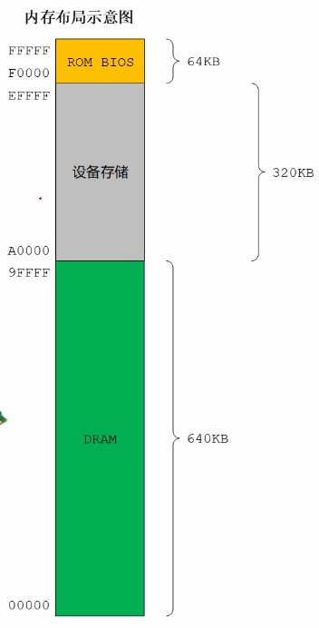
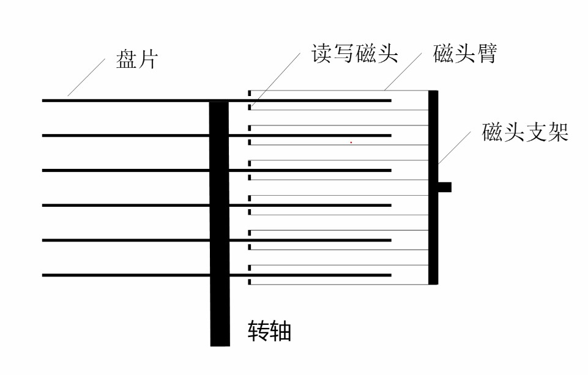
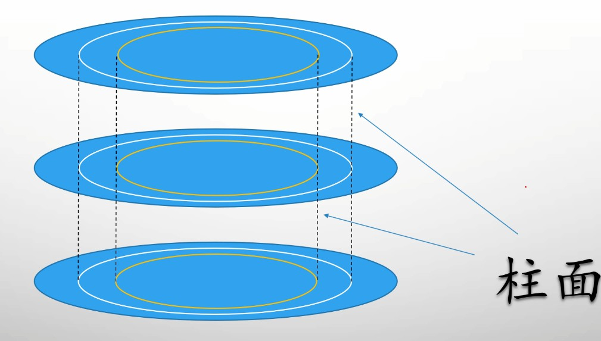
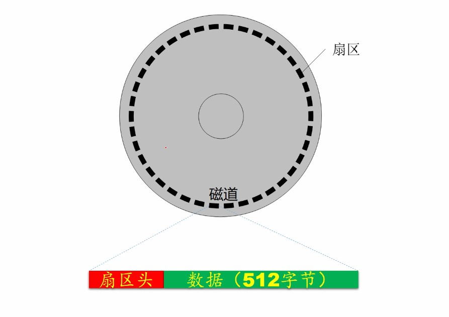
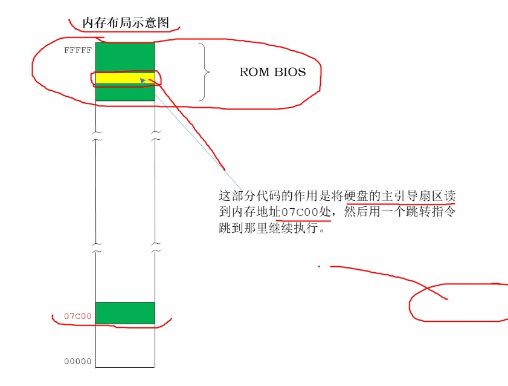

## 8086 加电或者复位的状态
```
电脑加电或触发RESET信号
1.硬件会初始化
2.可选的内部测试
3.将内部所有寄存器内容置未初始化的值


8086 处理器

AX BX CX DX SI DI BP SP 0x0000

CS 0xFFFF
IP 0x0000
DS 0x0000
ES 0X0000 附加数据段寄存器


CS(OXFFFF)<<4 + IP(0x0000) =0xFFFFO 加电 RESET 信号后执行的第一条指令的地址

```
## 8086地址空间分配

```


8080 访问内存区间 0x00000-0xFFFFF 1M


DRAM:0X00000-0X9FFFF  640kb
外部设备接口卡: 0xA0000-0xEFFFF 320 kb    
ROM BISO:0xEFFFF-0xFFFFF  64 kb


CS(OXFFFF)<< 4+ IP(0x0000) =0xFFFFO 加电 RESET 信号后执行的第一条指令的地址

0xFFFFO 加点复位第一条指令位于 ROM BIOS 区域内
  BIOS 程序对计算机的基本模块诊断和初始化等其他程序


```
## 跳转指令
```
FFFF0->FFFF 只有16byte, 所以 这16 byte 

EA 5B E0 00 F0 ...

    EA 跳转指令操作码   
    E05B 跳转偏移地址
    F000  跳转段地址
    jmp 0xF000:0xE05B  跳转到逻辑地址 取指令并且执行
     
    此时 CS 0XF0000 ,ip 地址 0xE05B

BOIS 还固化指令读取硬盘数据放入内存继续执行


1.以下哪些指令与JMP 0xF000:0xEO5B 等效
A:  JMP 0xFE05:0x000B  ; 物理地址  0xFEO5B 
B:  JMP 0xFE00:0x005B ; 物理地址  0xFEO5B 
C:  JMP 0xFFFF:0x000B ;  物理地址  0xFFFFB 不等效 
D:  JMP 0xFD00:0x105B ; 物理地址  0xFEO5B 

JMP 0xF000:0xE05B 跳转到物理地址 0xF000<<4+ 0xE058 = 0xFEO58B继续执行

```
## 硬盘的构造和工作原理



```
RPM:磁盘的转速度
磁头:每个盘片有两个磁头上下各一个
    磁头编号 0开始

磁头臂: 
    带动磁头移动


磁道:
    磁头围绕磁盘画的看不见的圆环

    编号0开始从磁盘最外处开始计算
柱面:
   每个盘面同一磁道形成的看不见圆柱
   


存储顺序:
    从柱面开始储存(每一个盘面统一标号的磁道)


扇区:
    每个磁道的扇区数取决于磁盘的制造者(note:通常为63个扇区)
    
    扇区之间存在空白间隙


    扇区:
    [扇区头 ] +[数据(512 byte)]
    [扇区头 ]:
        磁道号
        磁头号
        是否健康
      用处:用于磁盘定位使用

```
## 一切从主引导扇区开始

```
ROM BIOS:
  自检程序和基本模块执行完毕后...
  会将硬盘主引导扇区的内容读取到 0x07c00 处
  会使用一个跳转指令跳转到0x07c00执行引导扇区的代码


主引导扇区
   0磁头( 0磁盘) 0磁道  1 扇区


JMP 0x0000:0x7C00
此时 CS 0x0000  IP 0x7C00


```