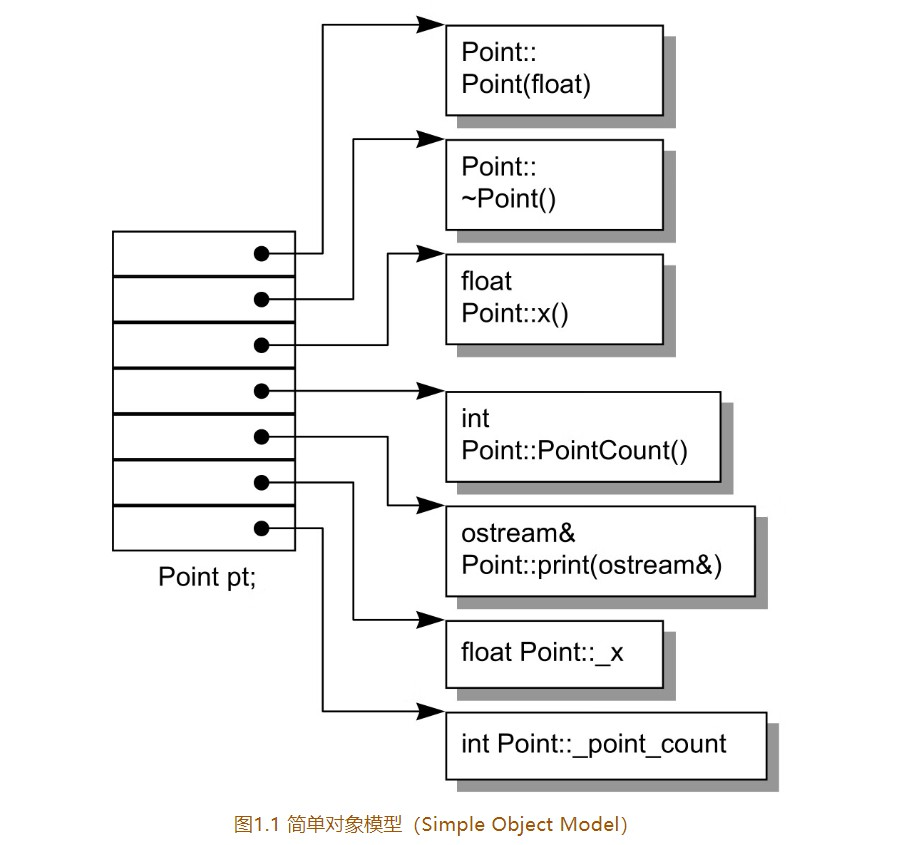
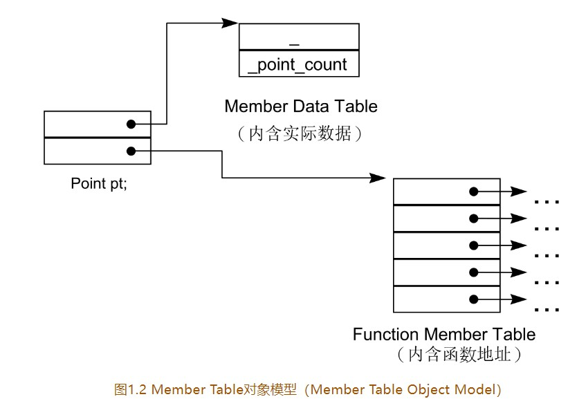
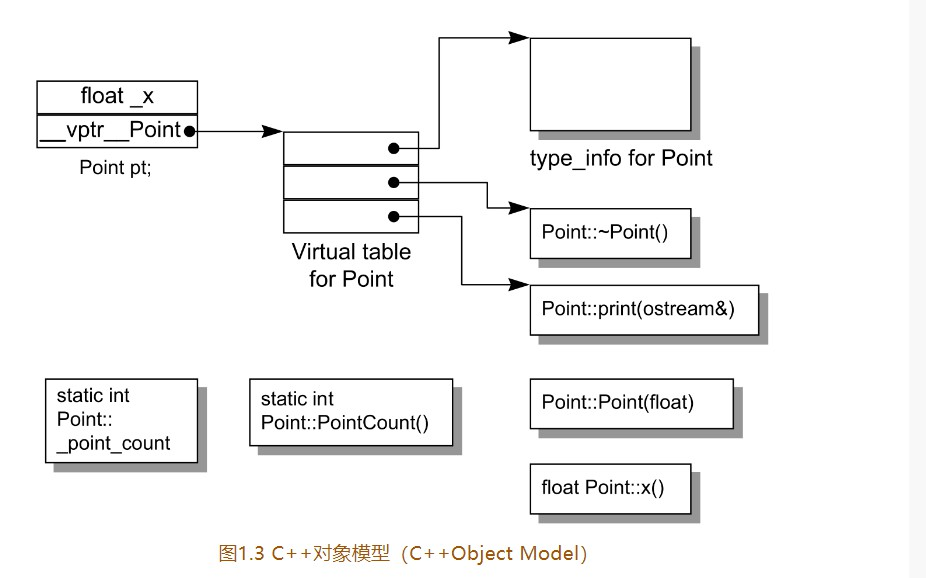

# 关于对象
### 加上封装后的局部成本
```
data members 在 class object 中(像 c struct 中)
member functions 
   non-inline member fuction 只会诞生一个实例
   inline member fuction 会在每一个使用者模块产生一个实例


c++ 在布局以及存取时间主要负担是由virtual引起
    virtual function 
        runtime binding
    virtual base class


c++ 多重继承

c++  class data members static 和 nostatic

```
### 简单对象模型

```
memebers 本身并不放在object中,
每个member 的指针会放在object中


note:
  每个member 是在object里面寻址的


简单模型并没有应用到实际产品中
```
### 表格驱动对象模型

```
1.把class 模型的 members 相关的信息抽出来
2.将memeber 信息放在 data member table 和 一个member fuction table 之中


class object 本身含有指向者两个表格的指针


data member table 
    存放对象本身数据

member fuction table
    每个slot 指向函数的地址值


表格驱动对象模型也没有用到实际产品中

```
## C++对象模型
```
non static data member 存放在object 内

static data member 存放在object 之外


static and  nonstatic function member 也存放在object 之外


virtual function:
    1.每个class 产出指向一堆指向virtual functions 的指针,该指针放在表格之中。这个表格称为 virtual table (虚表)

    2.object {

        vitualtable vptr; 指向虚表的指针
    }


    class constructor ，copy assignment  destructor 
        设置 重置 


每个class 关联的type_info object (用来支持运行时类型认证) 也是由virtual table 指出来
    note:
        type_info * object 信息通常放在 virtual talbe slot第一个


```
**CPP对象模型**


```cpp

class Point{
    public:
        Point(float x):_x(x){

        }

        virtual ~Point();
        static int PointCount();
    protected:
        virtual ostream& print(ostream &os) const;
        float _x;
        static int _point_count;
}


object 对象
[
    float x;
    __vptr__Point * p;//虚表止指针
]


Virtual Table
[
    type_info *ptr; //类型表指针
    void * ~Point;//虚函数析构函数指针
    void * ~Point;// 虚函数指针
]


static int _point_count;

static int Point::PointCount;

Point::Point(float)


```
### 加上继承
```
CPP 单一继承
CPP 多继承


or 虚拟继承

class istream:virtual public ios{};
class ostream:virtual public ios{};

note：
   不管base class 在继承串链中被派生多少次,永远只会存在一个实例(subobjecty)
    例如:
        istream or ostream 中只有 virtual ios base class 一个实例


cpp 最开始的继承模型
  base class object data members 
  和 object data members 存放在一起

  优点:
        存取效率高(没有间接存放和获取)
  缺点: 
        当sub class  和 class 有任何改变(增加,移除,类型修改)都需要重新编译


C++ 2.0 才新导入的virtual base class 

```
### 对象模型如何影响程序
```c

原始程序

X foobar(){
    X xx;
    X  *px=new X;

    // note  foo() 是一个virtual functioin 
    xx.foo();
    px->foo();

    delete px;

    return xx;
}


编译器编译的转化后的程序


void foobar(X &_result){
    _result.X::X();// 替代  X xx;


    //   X  *px=new X;

    _px=_new(sizeof(X))

    if(_px!=0){
        px->X::X();

    }

    foo(&_result);//    xx.foo();


    // 虚标 slot index 2 的地址
    // virtual 机制 扩展 px->foo()
    (*px->vtb[2])(px);//   px->foo();


    if(px=!0){
        // 虚标 slot index 1 的地址
        (*px->vtb[1])(px);// destructor 析构函数调用
        _delete(px);
    }


    //无需手动销毁 local  object xx
}


```
## 1.2 关键词带来的差异
```
int (*ptr)(1024);
    编译器 判断上面的代码是声明的代码 or 指向函数的代码 需要读取到1024
    才能判断是在调用 ptr  function 


int (*ptr)();
会被编译器判断成声明

note:
    当语言无法区分声明还是表达式的时候 需要一个超越语言范围的规则,
    上述的会通过规则会被判断为声明

```
### 关键词的困扰
```cpp
struct C_Point{

}


class  Point: public C_Point{

}


Point c 和 c++ 都能支持


extern void draw_line (Point point,point)
extern "C"  void draw_rect( C_Point,C_Point )


draw_line(Point(0,0),Point(100,100))
draw_rect(Point(0,0),Point(100,100));


note:
  上述的使用方式 不被推荐(例如Micsoft CPP )在支持 virtual function 机制对class继承布局做了一些修改


推荐使用


class  Point{

    public:

        // 转换运算符符号重写
        operator C_Point(){
            return c_point;
        }

    private:
       C_Point c_point; // 拥有与C 兼容的布局

        


}


note:
   兼容与C的布局 只在组合情况下保证 
   在继承的情况下内存的布局是不被保证的

```
## 1.3 对象差异
```

```