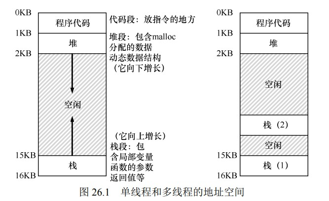

# 并发:介绍
```
线程:
   程序计数器(PC)

多个线程之间共享内存地址

进程上下文切换
   将进程的状态保存到PCB(Process Control Block)

线程上下文切换
  需要一个或多个线程控制块(TCP) 保存线程信息


线程和进程的上下文区别
  线程切换，地址空间不变(页表不需要切换)

```

```

位于栈上的变量,参数，返回值，和其他放在栈上的东西
有时候这些东西被称为防止在线程本地存储的地方(thread-local)

```
### 线程的创建
### 共享数据
### 核心问题
```
load counter
add counter
store counter


例如  两个线程(1,2)

counter=50 
线程1
   load counter eax=50
   add eax+1
时钟中断,线程切换上下文 os刚好调度线程2 执行

线程2
  load counter eax=50
  add eax+1
  store counter =eax =51

时钟中断 切换上下文 os 调度到线程1 执行
线程1 继续执行
  store counter =eax=51


note:
   counter 被加了两次但是值是51,然而正确的结果是52。 


将存在竞争条件的代码区域称为临界区

```
### 原子性愿望
```
原子指令
   发生中断 原子指令只有两种状态 
     执行完成,还未执行 


```
#### 如何实现同步
```
构建同步语句
  硬件提供哪些支持
  OS提供哪些支持
```
### 等待另一个线程
```

```