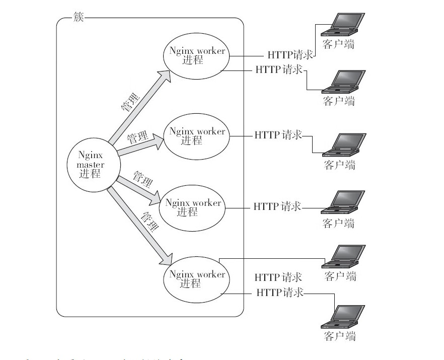

# Nginx的配置
## 2.1 Nginx 运行中的Nginx进程关系

```
Nginx

master 1个 
    只负责管理所有的worker 

    提供以下服务
        1.启动服务
        2.提供服务
        3.平滑升级
        4.重载配置文件

    master 进程通常需要较大的权限

worker 和服务器上的CPU 核心数相等
    真正提供服务的进程


    woker 进程的权限通常小于或等于master进程
    

任意一个进程出现错误coredump 时 ,master 会立即新启动一个进程继续服务


为什么将worker数量和服务器CPU核心数量设置的一样多?

对比与Apache
   Apache 
     一个请求需要一个进程进程处理,如果同时大量请求访问服务器,
     则会消耗巨大的系统资源,进程间切换 进程创建销毁,会造成巨大的消耗

Nginx
     一个Worker(进程) 可以同时处理请求数量只限于内存的大小
     不同的worker 之间并不存在同步锁机制，
     worker 通常也不经常睡眠状态
     worker 进程切换次数亮少,所以切换代价小
    
```
## 2.2 Nginx 配置的通常的语法
```

http {
    include       mime.types;
    default_type  application/octet-stream;

    #log_format  main  '$remote_addr - $remote_user [$time_local] "$request" '
    #                  '$status $body_bytes_sent "$http_referer" '
    #                  '"$http_user_agent" "$http_x_forwarded_for"';

    #access_log  logs/access.log  main;

    sendfile        on;
    #tcp_nopush     on;

    #keepalive_timeout  0;
    keepalive_timeout  65;

    #gzip  on;

    server {
        listen       80;
        server_name  localhost;

        #charset koi8-r;

        #access_log  logs/host.access.log  main;

        location / {
            root   html;
            index  index.html index.htm;
        }

    }


}


注意:
    块配置可以嵌套,内层直接继承外层块

    例如:
        server 模块里面的任意配置都是基于http模块里面有的配置


    note:
        当内层模块和外层模块之间属性发生冲突的时候,到底是使用内层或外层的属性,这取决于解析配置的模块
```

###  2.2.2 配置项语法格式
```
配置项名 配置项值1 配置项值2 .....;


配置项名:必须是Nginx 某一个模块想要处理的
; 来作为配置项结束

```
### 2.2.3 配置项的注释
```
# 注释
```
### 2.2.4 配置项单位
```


存储空间

gzip_buffers 48k;
client_jamx_body_size 64M;

k/K  kb
m/M MB

时间
ms s m h d w M(月 20天) y


note:
  配置中使用使用什么单位取决于解析该配置项的模块
```

### 2.2.5 在配置中使用变量
```
    #log_format  main  '$remote_addr - $remote_user [$time_local] "$request" '
    #                  '$status $body_bytes_sent "$http_referer" '
    #                   '"$http_user_agent" "$http_x_forwarded_for"';


remote_addr 是一个变量 


```
**note**
```

是否启用这些模块,取决于是否在配置文件配置改配置,每个模块有自己感兴趣的模块
```
## 2.3 Nginx 的基本配置
```
配置分类:
1.调试
2.正常运行的必须项
3.性能优化项
4.事件配置项(events{} 里面配置一般归到性能优化项)

```
### 2.3.2 调试相关的配置
```
1.daemon on|off 
默认: daemon on


2.是否以master worker 方式工作
master_process on|off
默认 master_process on


3.error 日志
error_log  logs/error.log level;
level:
  debug
  info
  warn
  error
  crit
  alert
  emerg

  note:
     设置上面日志级别的时候,大于或等于该级别的日志会输出

      debug 日志级别
         必须在执行的configure 的时候 加上 --with-debug 配置项目


4.是否处理几个特殊的调试点
debug_points[stop|abort]

  stop:
      Nginx 执行到这些调试点的时候会发出SIGSTOP

 abort
      会Nginx 代码执行到这些调试点的时候会产生coredump

      note:
         core_dump 文件可以使用gdb查看执行到这些调试点的时候的信息


5. 对指定的客户端输出debug 日志
  note:
     在执行的configure 的时候 加上 --with-debug 配置项目

debug_connection[IP|CIDR]

   events{
      debug_connection[IP|CIDR]
   }

    客户端制定
       IP地址
       CIDR地址


CIDR 地址
    例如
      A.B.C.D/N
      N : 表示的是ABCD 二进制长度
        取值范围 (0,32) 11111B=31
      
     例:
       /20 表示前缀的长度是20的CIDR 地址块


     怎样判断一个IP地址是否匹配CIDR地址块?
    A.B.C.D/20
    如果一个IP 前20bits 和上面相等则该IP属于CIDR地址块


    

6.限制coredump 转处文件大小
worker_rlimit_core 


7.指定coredump 文件生成目录
working_directory path;
```
### 2.3.3 正常运行的配置项
```
1.  环境变量的定义

env VAR|VAR=VALUE;

例如:
  env TESTPATH=/tmp/;


2.包含其他配置文件进来
inlude path;
include path/*.ccc;

note: 
  * 表示通配符号 一次引入多个满足通配要求的文件


3.pid 文件路径
#pid        logs/nginx.pid;

note:
   1.可以在执行configure的时候 --pid-path 指定
   2.可以在nginx.conf 指定


4.Nginx worker 进程运行的用户和用户组
user username [groupname];
默认:
   #user  nobody nobody;

   note:
      user username;
      用户名和用户组名相同


  
  configure  通过下面的方式执行用户名和组 
       --user
       --group
    则  nginx.conf
    user username usergrop ;就是通过上面指定的用户和组


```

### 优化性能的配置项目
```


timer_resolution 100ms;
note:
  nginx 缓存时钟
  每次执行内系统调用的时候返回的时候会执行gettimeofday() 实现内核时钟更新Nginx缓存时钟
  
  早期Linux 执行gettimeofday() 代价不小 每次执行返回结果都会将数据从内核复制到用户态内存吧
  
   timer_resolution 100ms;用来控制gettimeofday() 控制调用频率
  


```
## 2.4 Http核心模块配置一个静态web服务器
### 2.4.1 虚拟主机域请求分发
```
server_name:

http Header Host 属性
配置优先级
1.完全匹配
2.前置通配符匹配
  例如 *.xx.com
3.后置通配符匹配
  www.xx.*

4.正则表达式匹配


如果上述的规则都不匹配按照下列顺序
1.listen [default|default_server] 的配置
2.lisen 第一个


note:
1.server_name:"" 如果http 请求没有Host,会匹配
2.使用不同的server_name 提供不同的服务


localtion:
1.= 完全匹配

location = /{
  // 只有当用户uri =/ 的时候才会匹配
} 


2.~ URI 大小写敏感
3.~* 忽略大小写敏感
4.^~ :URI 执行的前面部分匹配即可
  location ^~ /images/{

  }
  /images/ 开始的请求匹配即可

5.@ Nginx 内部之间重定向(@ 不直接处理需用请求)

6.正则表达式
location ~* \.(gif|jpg|jpeg)$

 

当有多个location 满足匹配,选择的顺序如下

note:
  如果存在多个匹配URI地址,则会被多个满足条件的第一个匹配


  建议: 下面location 放在最后,他会匹配所有的location 
    location / {

    }


root
配置块:
  http server location if
# root 文件路劲定义 相对于http 请求的根目录


alias
配置块:

    例如:
    location /conf{
      alias /usr/local/nginx/conf/;
    }


    URI
    /conf/nginx.conf


    实际访问到文件

    /usr/local/nginx/conf/nginx.conf


  note:

    URI
    /conf/nginx.conf
   root 设置

    location /conf{
      root  /usr/local/nginx/ 
    }
  


  alias:实际是URI 实际是路劲映射过程
 
     location /conf{
      alias /usr/local/nginx/conf/;
    }

  会被映射为

  URI
  /conf/nginx.conf
  
  path/conf/nignx.conf


alias 正则表达式匹配 (\w 相当于[a-zA-Z_])
location ~ ^/test/(\w+)\.(\w.+)${
  alias /usr/local/nginx/$2/$1.$2
}


URI: /test/nginx.conf
上面的正则表达式匹配到的文件地址
/usr/local/nignx/conf/nginx.conf


index file ...；

        location / {
            # root 文件路劲定义 相对于http 请求的根目录
            root   html;
            index  /index.html /html/indexphp /index.php;
        }


error_page[code....][=!=answer-code][uri|@named_location]
error_page  404              /404.html;


 error_page   500 502 503 504  /50x.html;


note:
  通过上面的配置虽然被重定向了 URI 但是默认返回错误码不会改变


  =修改返回的错误码
  error_page 404 = 200 /empty.gif;


发生请求错误,重定向到另一个location

location /(
  error_page 404 @fallback;
)


location @fallback(
  proxy_pass https://backend;
)


返回的404 会被反向代理到https://backend 上游服务器中处理


recursive_error_pages 

  能否允许地柜使用error_page

默认:  recursive_error_pages  off；


try_files

Syntax:	try_files file ... uri;
try_files file ... =code;
Default:	—
Context:	server, location


```
