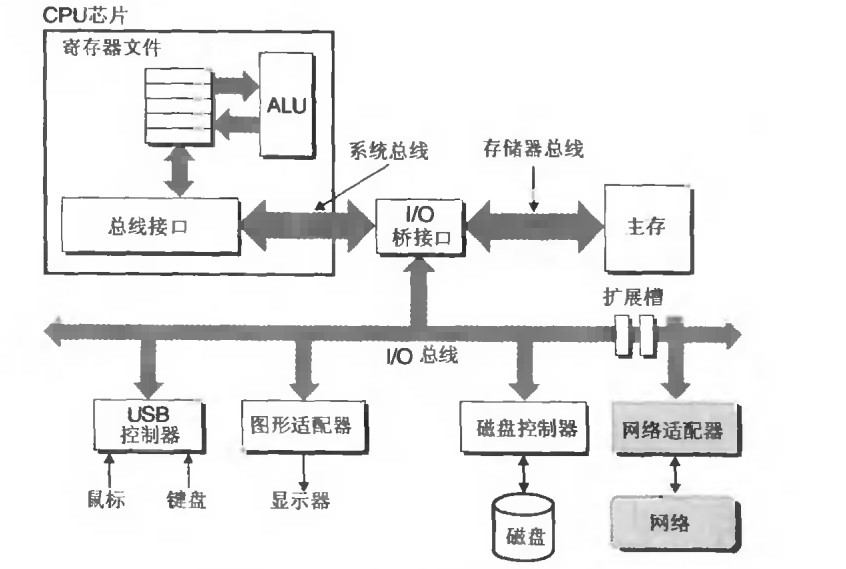
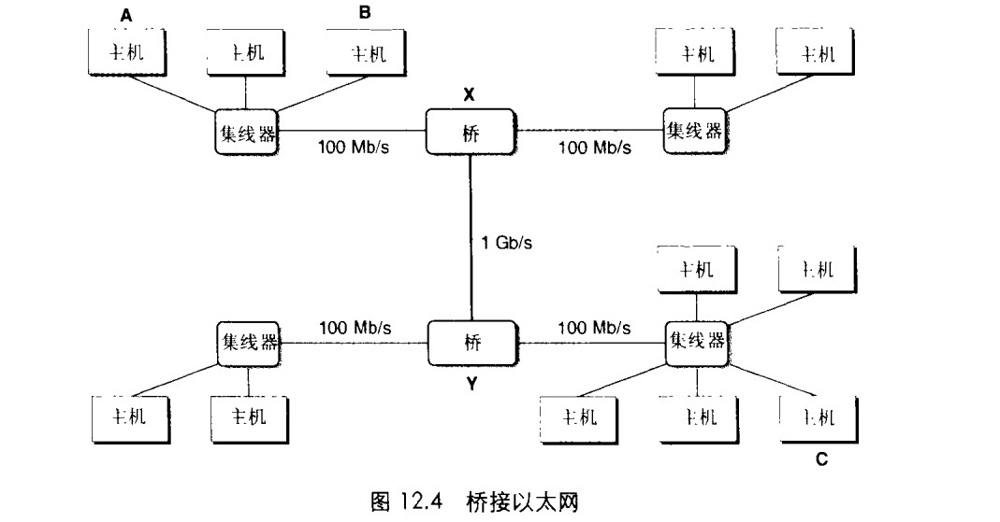
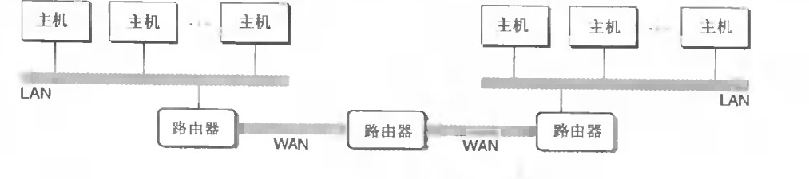
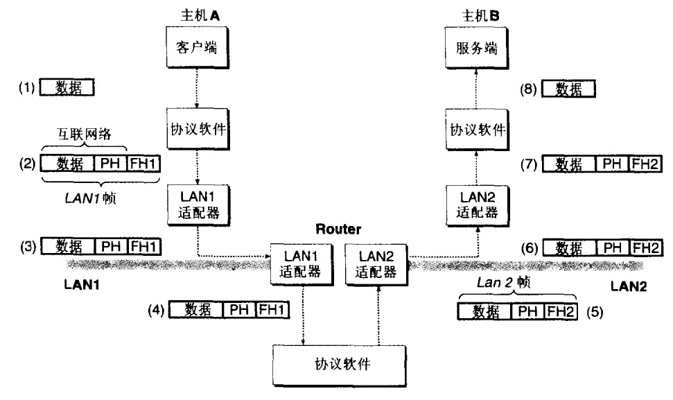

# 网络编程
## 客户端-服务器模型
```
客户端-服务器模型中的基本操作是事务
1.client-req-server
  发送请求,发起一个事务
2.server get req by client , 做对应事情操作
3.服务器给客户端一个响应


note:
  认识到时客户端进程和服务进程之间通信,无论是在同一个台机器和不在同一台机器上服务器和客户端通信,映射到模型上是一样的
```

## 网络
```
1.对于主机而言
    网络知识又一种I/O设备
2.做为数据源和数据接收方
```

```
网络接收数据
    网络适配器 经过 I/O总线和存储总线拷贝到存储器（DMA 直接储存器存取方式）

数据发送
   DMA 从存储器 经过 存储总线和 I/O总线拷贝到网络
```

```
LAN(Local Area Network 局域网) 
以太网就是局域网技术(施乐公司帕洛阿尔托研究中心)


以太网段
   电缆(双绞线)+集线器小盒子

    服务
      小区域,例如: 房间或者一个楼层.


每台主机使用一根电缆从主机适配起到集线器端口进行连接
    


集线器不加分辨的从一个端口手到每个位赋值到其他所有端口,因此每台主机都能看到每个位


以太网适配起都有一个全球唯一的48位地址(MAC地址)
一台主机可以发送一个段位,称为帧frame


```

```
网桥的网络设备

如果要是局域网更加大的则需要使用网桥设备将多个网段的小局域网桥接起来

网桥比集线器更加充分的利用电缆带宽,利用聪明的分配算法,它门随着事件自动学习哪个主机可以通过那个端口可达有选择将帧从一个端口拷贝到其他端口。


主机A 发送 帧 数据到 主机 B
   该数据到达桥X的时候会把数据丢弃(节省了网络带宽)


A 发送数据到C
  网桥X会将数据拷贝到网桥Y相连的端口,网桥Y只把数据拷贝到与主机C网段相连的端口上


在层次更加高的级别中
多个不兼容的局域网可以使用路由器 连接起来组成一个internet(互联网络)

```

```
每台路由器
  对于与它相连的每个网络都有一个适配器(端口)


路由器也能连接高速点到点电话连接,称为WAN(Wide-AREA Network 广域网)

一般而言路由器可以使用各种局域网和广域网构建internet(互联网络)


internet 网络至关重要的特性
  使完全不同和不兼容的各种局域网和广域网组成


如何使源主机跨过所有不兼容的网络发送数据位到另一台目的主机?
   解决方法
   1.使用每台物理机和路由器上面运行一中协议软件,控制路由器和主机之间协同工作来实现数据的传输


协议需要具备的能力:
   1.命名方法
    不同的局域网网络技术有不同和不兼容的方式来为主机分配地址
    internet 通过一种一致的主机地址格式消除这种差异。
 
     每台主机至少分配一个internet地址来唯一的标识它
    
   

   2.传送机制
    internet 协议通过将数据捆绑成不连续的组块(chunk)--也就是包--的统一方式消除这些差异
```


```
1.A 客户端系统调用从虚拟地址空间拷贝数据到内核缓冲区
2.A 上的数据协议软件构建数据
    LAN1帧头+A主机internet地址+B主机internet 地址
  


    LAN1 + intelnet数据 通过 LALN1 寻址到路由器


3.LAN1 适配器拷贝帧到网络上

4.帧叨叨路由器
   LAN1 适配器从电缆上读取,将数据传送到协议软件

5.
    路由器从internet 包头提取目internet 的目的地址
    查询路由表确认从那个端口发送数据

    路由器剥落LAN1t头 加上LAN2帧头并且把数据传送到适配器
6.LAN2适配器拷贝帧到网络上
7.帧数据到达主机B,适配器读取到此帧的数据并且传送到协议软件
8.主机B保罗包头和帧头,当服务器读取数据的时候会将数据拷贝到用户的虚拟地址空间

```
## 全球IP因特网
```

```
