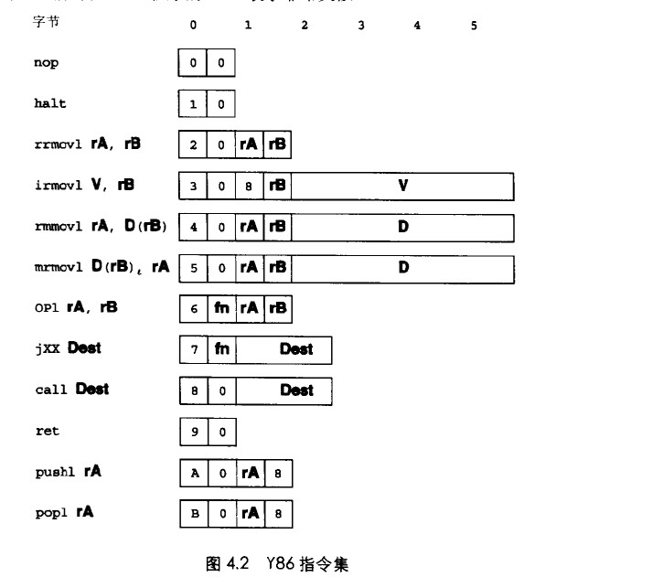
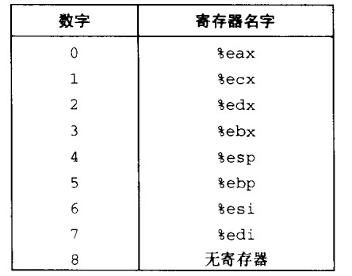

# 处理器体系结构
```
ISA:指令和指令的字节码(instruction-set architecture)

IAS:
    为编译器编写者和处理器设计人员提供了概念的抽象层


编译器开发者:
    只需要知道有允许哪些指令

处理器设计者:
    必须建造出执行这些指令的处理器


问题:
1.计算机如何工作?
2.计算机制造商面临的哪些技术挑战?

```


## 4.1 Y86 指令集体系结构
```
8个程序寄存器 每个寄存器大小 1 word
eax ebx ecx edx  esi edi esp ebp

esp:
入栈,出站,调用函,返回 都会影响 esp的值 esp 被称为栈指针 


条件码:保存算数或逻辑指令 造成影响的信息
    ZF SF OF


PC：计算器
    存放的当前程序正在执行的地址


irmovl 源 目的
rrmovl 源 目的
mrmovl 源 目的
rmmovl 源 目的
源:
    i(立即数) r(寄存器) m(存储器)
目的
    r(寄存器) m(存储器)

note:
    1.标准和IA32一样 不能通过 m 到 m数据转存
    2. 不允许 i 转存到m


OPI 指令
addl
subl
andl
xorl

note: 
    1.只对寄存器数进行操作
    2.这些操作会影响操作码数据
        ZF SF OF   


跳转指令
    jmp
    jle
    jl
    je
    jne
    jge
    jg


call 指令
    将返回地址压入栈
    跳转到目的地
    ret 执行 将返回地址弹出 返回到返回地址继续执行


pushl popl
    出栈 入栈


halt
    停止指令的执行(导致整个系统的停止)


指令的字节级编码(1-6字节):


第一个字节:
    [指令类型:4bits,功能:4bits]
    高4its:取值 0-B 

    例如:
        整数操作
            addl [6:0]
            subl [6:1]
            andl [6:2]
            xorl [6:3]
        分支操作
            jmp [7:0]
            jle [7:1]
            jl  [7:2]
            je  [7:3]
            jne [7:4]
            jge [7:5]
            jg  [7:6]


八个程序寄存器都有相应的寄存器ID 0-7 计算器标识符
计算器ID 值为8  指明当前没有寄存器作为操作数


只需要一个寄存器的指令会将另一个寄存器的指示符设置为8
    irmovl 立即数  register
    pushl 寄存器
    popl 寄存器


需要附加常数的指令
    立即数
    irmovl 

    地址指示符的偏移量
    rmmovl
    mrmovl 
  
    分支指令调用的目的地址


小端
rmmovl esp 0x12345(%edx)
rmmovl [4:0] =0x40

rmmovl  esp edx  
[0x40]  [42]    [ 45 23 01 00] 


IAD2
testl 指令 test 操作 将两个数字做and操作 并不保证结果 只改变 标志寄存器状态
    testl dest,src
    and =0 zf 会被标志
    and 结果 最高位为1 那么 sf标志就会被设置

    如果未模式表示一个负数OF 会被设置


```
**y86指令集**</br>
 
**y86寄存器标识符**<br>
