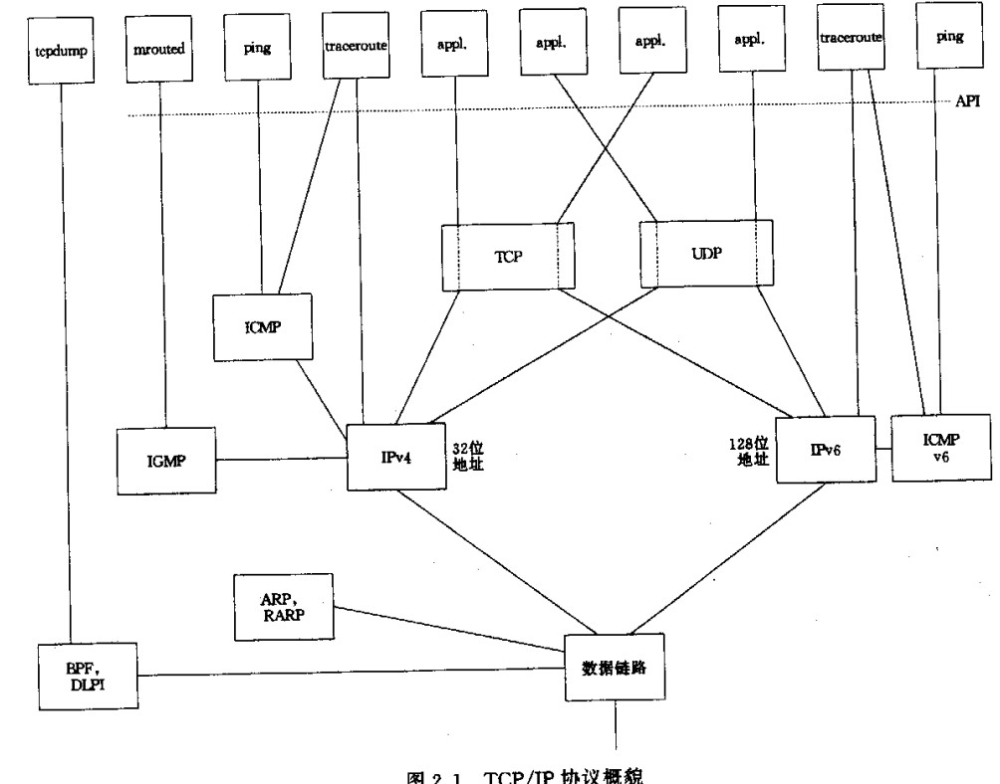
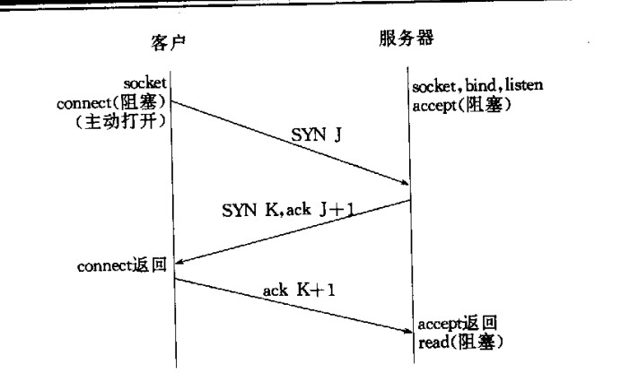
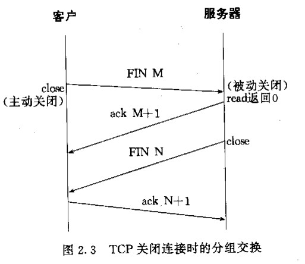
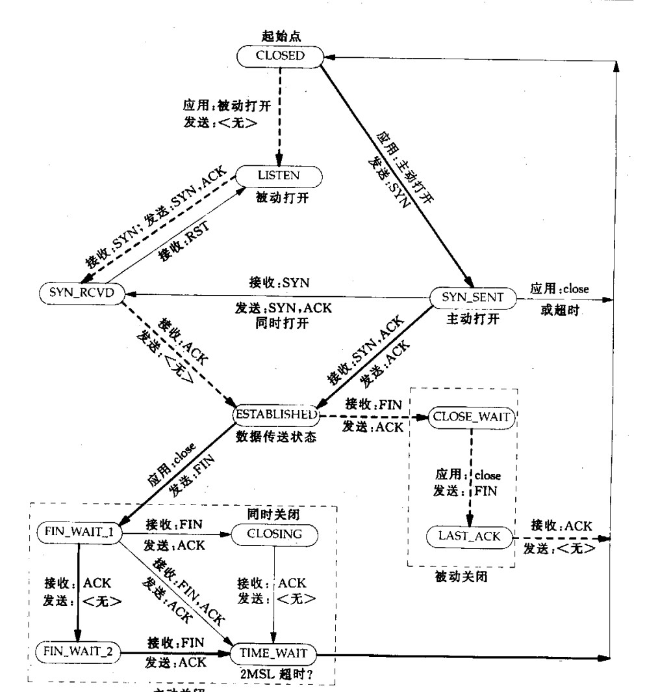
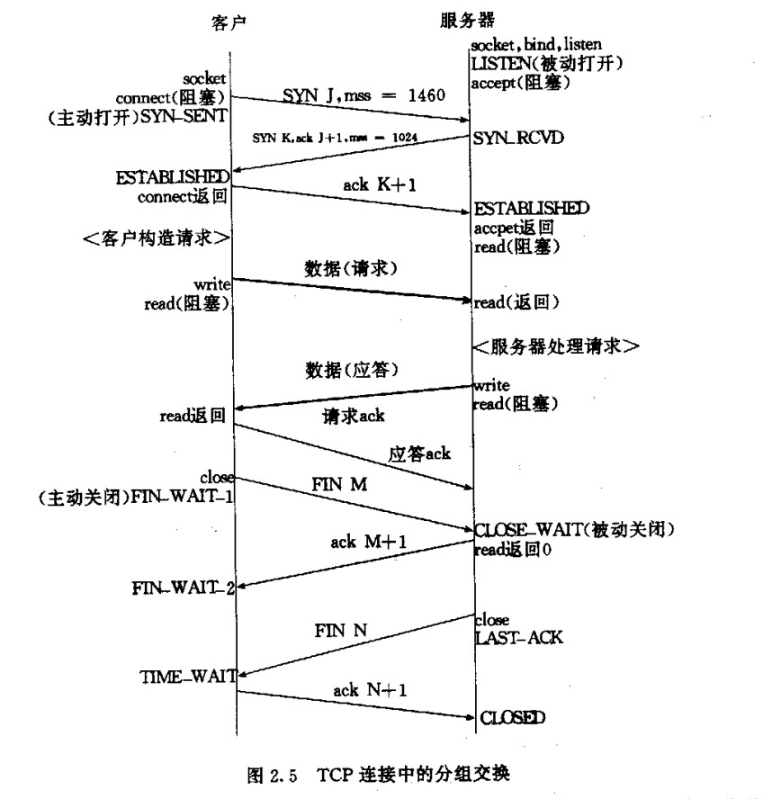

# 概述
```
1.tcp 三次握手
2.tcp 终止序列
3.tcp 的TIME_WAIT状态
4.套接字的UDP和TCP机制
....
``` 

## 总图

```
traceroute 程序
    
       ICMP/IP   -----数据链路
    
IP层/网络层:

    IPV4 服务于
        ICMP IGMP TCP UDP

    IPV6 服务于
        TCP UDP ICMPv6


ICMP/ICMPv4
    处理路由器和主机之间的错误和控制消息
    ping 程序(ICMP)

IGMP

ICMP v6
    综合了ICMPv4 IGMP 和 ARP的功能

传输层:
    TCP
        面向连接
        可靠
        字节流接口
    UDP
        无连接
        不可靠
        
ARP
    地址解析协议
    ARP 把 IPV4 的地址映射到硬件地址(如以太网地址)
    ARP 一般用于广播网络(以太网网,令牌环网和FDDI note:除点对点网络) 
RARP
    硬件地址映射到IPV4地址


BPF
    berkeley 内核可以找到
    为进程提供了访问数据链路层的接口    
DLPI
    数据链路层提供者接口
    SVR4提供
```
## UDP:用户数据协议
```
UDP ->ipv4/ipv6 头部添加-->链路层头部添加

UDP 缺乏可靠性:
    可靠机制:
        另一端的确认
        超时
        重传
        等
```
## TCP:传输控制协议
```
TCP 提供客户端和服务端的connection
TCP
   1.传输消息 给对方,需要对方向自己发送一个确认,
   2.没有接受到对方的确认消息,会自动重新传送消息(多次重传 每次等待的重传的时间会增加)
        note:
            如果数次重传失败,TCP 会放弃


           RTT(round-trip time)往返花费时间的算法:
                 TCP 含有动态估算客户到服务器花费时间的算法,因此会估算到等待确认大概花费多久的时间


    3.
        app process socket send 2048 bytes
        tcp 发送两个分接
            tcp msg1: a [1-1024]
            tcp msg2: b [1025-2048]    

        tcp 接收数据
            tcp msg2: b [1025-2048]   
            tcp msg1: a [1-1024]

           接收到数据 会根据消息顺序排序(非接收顺序)
            知道结束数据完毕把他交给上层的应用进程


         note:
            若接受当接受到重复的数据会把数据丢失
            note:
                由于网络堵塞 接收方没有接收数据的确认,认为接收方没有接受到信息,会重复在发送一条同样耳朵信息


UDP 不可靠
    UDP 本身不提供确认 序列号 RTT估算 超时重新传送
    UDP 数据报在网上被复制,UDP 接收端可能会就收到两份相同的数据
    UDP 发送两条数据,UPD 接收方可能会颠倒顺序的接收者两条信息


TCP 流量控制
         通告窗口: TCP 总是告诉对方自己能接收的字节数
         任何时刻:这个窗口指出接收缓冲区可用大小,从而确保发送方发送的数据不会溢出接收缓冲区
         note：
            窗口在实时的动态变化,窗口接收到数据大小减小,接收方数据应用进程从缓冲区读取数据的时候,窗口大小增大

            窗口大小减小到0是有可能的(TCP的接收区缓冲区满),如果出现这种情况,接收方必须等待应用进程从这个缓冲区读取数据后才能接收发送方来的数据


UDP 不提供流控制
    UDP 按照发送方的速率发送数据,不管接收方的缓冲区是否装的下


TCP 连接全双工
TCP 必须跟踪每个方向数据流的状态信息(序列号+通告窗口)


UDP 可以是全双工的
```

## TCP的连接的建立和终止
### 三次握手

```
1.TCP 服务器必须准备好接受外来的连接
    socket bind listen

2.客户端 connect 主动打开,会引起客户TCP 发送一个SYN分节(告诉服务器客户将在连接中发送数据的初始序列号)
        SYN节数据
            IP头部+TCP头部

3.服务器确认客户端的SYN,同时字节也发送一个SYN分节
    SYN(服务器在同一连接中发送数据的初始序列号)+ACK

4.客户必须确认服务器的SYN

```
### TCP 的选项
```
1.MSS(每个TCP 最大能接收的的数据量)
    TCP 发送SYN 带有MSS选项,告知对方我最大的分节大小(maximum segment size)
    TCP_MAXSEG(7.9 章)

2.窗口规模选项
    TCP双方能够通知对方最大的窗口是65535 (TCP 头部相应的字段大小只有65535)


    高速连接或长延迟路劲要求窗口更大,这样可以获得更大的吞吐量
    新选项指定 窗口扩大的位数(65535*2^14)
        (0-14) 取值
        65535*2^14 提供最大窗口几乎是1G


    note:
        如果要支持扩大规模的选项,必须系统双发都支持,否则不具备扩大窗口规模的能力

    
    SO_RCVBUF (7.5 章)


    如何提供与不支持这个选项较早实现的互操作性?
        TCP 可以打开一部分内容随它打点SYN 发送,只有当接受方SYN ACK 发哦送你个该选项的时候
        它才能扩大窗口


        note:
            server 只有接收到客户端发送SYN 判断有扩大窗口这个选项的时候,如果服务器实现,则会向客户端SYN ACK 这个选项 否则会忽略


3.时间戳选项(新选项)
    这个对于高速连接是必要的,防止失而复得的分组造成数据损坏

```
### TCP 连接终止

```
1.app close() 主动关闭
    app---FIN ----->server
 
2.server 接受到 FIN 消息 被动关闭
    FIN 由TCP 确认,并会向sever 应用程序 发送 结束符
    note：
        会排队等待应用程序结束的任何数据之后


3.一段时间server 接受到文件描述符号 server 会调用 close()关闭它的套接字
    server ----FIN----> app

4.app 接收到 server 的FIN 消息,并对齐进行确认


FIN 占据一个字节
  每个FIN的ACK 是这个FIN的序列号+1

```
### TCP 状态转换图

```
Closed 发送 SYN -->SYN_SENT

SYN_SENT  接受到 SYN ,ACK ----->状态转变为 ESTABLISHED(该状态是数据传送状态)


ESTABLISHED
    1.主动调用close()
    ESTABLISHED---->FIN_WAIT_1
    2.被动接受到FIN
    ESTABLISHED -->CLOSE_WAIT


note:
    18章回讨论同时打开和同时关闭
```

### 观察分组

```
app ---------------------------->server
  SYN j  mss 1640(ipv4典型值)
  app CLOSED--->SYN_SENT

server-------------------------app
    SYN k, ACK j+1,mss=1024
    server LISTEN--->SYN_RCVD

app 接收到SYN ACK 则 客户端 
    SYN_SENT----->ESTABLISHD

app connect 接收到服务器的SYN ACK 的同时向服务器响应 ACK K+1


app-----------ACK K+1 --------->server accept() 阻塞
      server 接受到ACK K+1 accept()返回
      SYN_RCVD-------------> ESTABLISHD 状态
    
       read() 阻塞


app 向服务器发请求消息
    有序接受到server的SYN mss 1024
    则发送消息的时候注意单分节数据长度不会大于1024

     write() 向服务器发送数据  数据请求

     read() 阻塞

server应答 发送单节不大于1460
    read() 返回
    获取到app 请求的数据


    write()  数据应答+请求ACK
    read() 再次阻塞 


app read() 返回 
    app 向 服务器发送应答ACK


app close()  
                FIN M
    ----------------------------------------->server
    ESTABLISHD--------->状态变为 FIN_WAIT_1


server 接收到FIN M

    ESTABLISHD--------->CLOSE_WAIT
    read() return 0

server------ACK M+1-----------> 
    server CLOSE_WAIT(被动关闭)

app 接收到 ACK M+1
    FIN_WAIT_2

server close() ---------FIN N ---------> 
    server 状态改变 CLOSE_WAIT--------> LAST_ACK

app 接收到服务器 FIN N
 CLOSE_WAIT-----------> TIEM-WAIT


server 收到 ACK N+1
   LAST_ACK ----->CLOSED


TCP底层实现了可靠性
如果要将UDP 实现可靠 二这些功能需要应用程序实现

```
## 2.6 TIME_WAIT 状态
```
主动关闭端会进入到TIME_WAIT 状态
TIEM_WAIT 状态停留的时间 MSL or 2MSL
MSL:最长分节生命期
MSL:RFC112 的建议是两分钟
    Berkeley 实现传统上使用的值是30s

note:
    根据上面的两种情况 TIME_WAIT
    状态停留时间是1 分钟 到 4 分钟


IP 头 TTL [8bits]  最大值 255
TTL 跳限不能代表时间，
我门任然需要假设255跳限分组不能超过MSL秒还继续存在


存在TIEM_WAIT状态的两个理由:
    TCP 全双工的可靠性

    server 接受到了结束符号 FIN M

    app FIN_WAIT_1  server: CLOSE_WAIT

    

    /*
    note: 正常流程
    */
     server--> ACK M+1
       server c
     app 接受到 ACK M+1
            FIN_WAIT_1-->FIN_WAIT_2
     server close FIN 
            server  LAST_ACK
     app 接收到FIN N
        FIN_WAIT_2-->TIME_WAIT
    
      
    app -----ACK N+1 ----->
    server 接受到 ACK N+1 server 
      LAST_ACK--->CLOSED


    note:
    app 此时的状态TIME_WAIT 
        服务一段时间没有等待到 app ACK N+1
        则服务器会再次向客户端发送FIN N,此时客户端必须维护状态信息
        允许以允许重发最终的ACK,
        
        如果app  不保留 TIME_WAIT 状态 则 app 接收到服务器发送FIN N
        则会解析未一个RST 信息 响应的数据 会被服务器解析错误

???
CLOSE_WAIT : 表示服务已经接收到客户端的关闭请求
   read() ==0
   服务器 CLOSE_WAIT 状态

  客户端未接收到 ACK M+1,二 接收到服务器(close()) FIN N


  
1.网络延迟故障
    丢包 网络堵塞等问题
2.服务器异常/ 无法正确处理客户端请求


异常情况:
    1.如果客户端设置了超时,客户端会会抛出超时异常
      导致无法处理后续操作
    2.客户端接受到服务器发送FIN,客户端可能会收到连接中断异常
      note:这种异常可能需要客户端执行一些清理操作
    3.资源泄漏
        未正确处理连接中断异常 客户端持续等待ACK而不释放连接资源,导致资源占用过高,最终资源用尽或程序崩溃 

    4.网络异常
       等待ACK的过程客户端遇到网络异常,客户端会抛出网络异常的异常


允许老的重复分节在网络中消失
    206.62.226.33:1500
    192.69.10.2  :21

    TIME_WAIT 状态的连接不能启动新的化生
    TIME_WAIT 持续的时间是2MSL，等待这么长的时间保证了在网络中的未被接受的数据都在网络中消失


    TIME_WAIT 防止连接的化生接收到上一个连接的数据


```
## 端口号
```
TCP和UDP 使用端口来区分进程
```
## TCP 端口号与并发服务器
```

bsdi 服务器
  206.62.226.35
  206.62.226.66

监听套接字 服务器只接受到某个本地特定本地接口的外来连接
    {*.21.*.*}

本地接口:*.21
远程接口:*.*
  
  通配符使用方式
  bind() INADDR_ANY


例如
client 192.69.10.2 connect 206.62.226.35:21
   假设客户主机的临时端口 1500,


note:
  监听套接接口的端口和连接套接口的端口都是一样


```
## 缓冲区大小及限制
```

IPV4 数据包 数据报最大 65535
    数据包总长占:16bits

    IPV4头+数据


IPV6  数据包 数据报最大 65575
    IPV4(40)+数据
     数据包总长占:16bits

    note:
        IPv6 有效负载长度不包含IPv6头部


    IPV6 有一个特大效负载选项 把有效负载长度扩展到32位(一般用于同一个主机之间)


MTU
    以太网:1500byte
    ipv4:最小的MTU是68byte
    ipv6:最小MTU 576


    note:
      ipv4  数据超过范围 路由器 和主机都会分片
      ipv6   数据超过范围  只在主机进行分片


      ipv6 路由器回产生分片,只会对由路由器产生的数据进行分片


ipv4 和 ipv6 必须支持的最小缓存区大小
ipv4 576
ipv6 1500

  note:
   所以很多udp 程序 为了 数据不丢失 都发送小于或等于最小支持缓冲区大小


tcp mss
  16bits 最大 65535   
  tcp 数据(65535-20ip头-20tcp头)


tcp ipv6(65535-20tcp) ip头不包含在里面


```