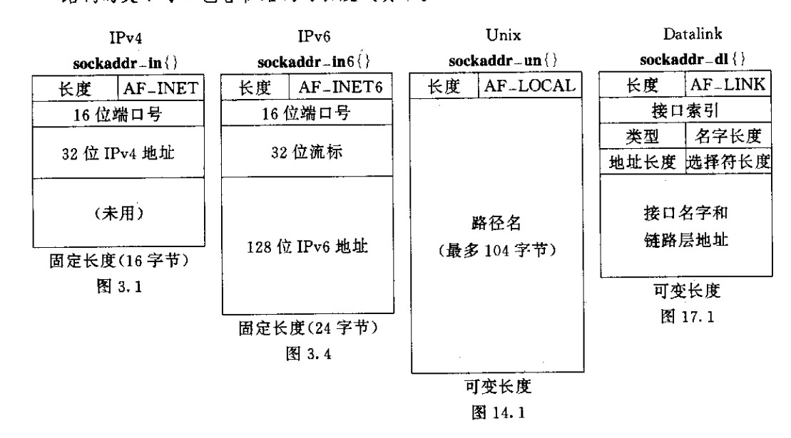

```c
ipv4
typedef uint32_t in_addr_t;
struct in_addr
  {
    in_addr_t s_addr; // 32 bits 无符号整数
  };


struct sockaddr_in
  {
   
    __SOCKADDR_COMMON (sin_);/*sin_family */
    in_port_t sin_port;			/* Port number.  */
    struct in_addr sin_addr;		/* Internet address.  */

    /* Pad to size of `struct sockaddr'.  */
    unsigned char sin_zero[sizeof (struct sockaddr)
			   - __SOCKADDR_COMMON_SIZE
			   - sizeof (in_port_t)
			   - sizeof (struct in_addr)];
  };


 uInit8_4 sin_len; 并不是所欲厂家都支持
 sin_len 是为了增加OSI协议的支持


从进程到内核传递套接口地址结构
bind connect sendto sendmsg 都要经历源自Berkeley 实现的sockargs


从内核到进程传递套接口地址结构
accept recvfrom recfmsg getpeername getsockname 


posix.1 只需要这个结构中的三个成员
sin_family
sin_addr
sin_port


IPV4 地址和TCP UDP 端口号总是以网络字节序存储

```
### 通用套接口地址结构

### 套接口地址结构比较

```
IPV4 IPV6 Unix域 数据链路
AF_INET AF_INET6 AF_LOCAL AF_LINK

IPV4 和 IPV6 定长
UNIX域和数据链路结构是可变长度

```
## 字节排序函数
```
```