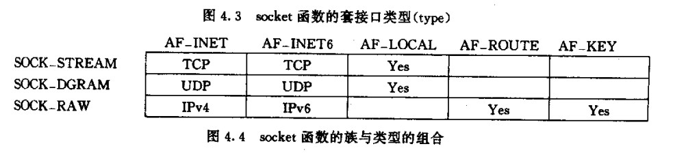

## socket 函数

```c
#include <sys/types.h>          /* See NOTES */
#include <sys/socket.h>
int socket(int family, int type, int protocol);


family:协议族
type: 套接口类型
protocol:一般来说设置为0 25 章回讨论


note:
    AF_UNIX(原来UNIX的名字)
    AF_LOCAL(Posix.1g 名字)


int s= socket()
s>=0 套接字描述符号


AF_XXX  与 PF_XXX

AF_XXX 地址族
PF_XXX 协议族
PF_ 创建套接字口
AF_套口地址结构


```
## connnect 函数
```c
#include <sys/types.h>          /* See NOTES */
#include <sys/socket.h>
int connect(int sockfd, const struct sockaddr *addr,socklen_t addrlen);


connect() 调用会触发三次握手
  返回 要么连接成功 要么连接错误


连接错误的情况
1.
    tcp 客户端没有接受到SYN 的响应
    6s 发送一次
    24s 在发送一次
    75 s在发送一次
    在等待一段时间 如果还没有收到响应返回错误ETIMEDOUT

2.客户端SYN 到服务器服务器收到的是RST响应
  说明要连接的主机进程没有对应等待的进程

  客户端接收到RST 响应会马上返回ECONNREFUED,


  note:
    RST消息触发的三种条件
    1.SYN 到达某端口没有正在监听的服务器
    2.TCP 取消一个已有的连接
    3.TCP 节后了一个不存在连接上的分节


3.客户端发送SYN,中间的的路由器发出了一个目的不可达的ICMP错误
    客户端的内核会每个时间发送一条重试 到达重试机会还没有收到SYN 响应
    会报EHOSTUNREACH OR ENETUNREACH(过时的错误) 错误返回给应用进程


note:
  早期系统BSD4.2 在接收到ICMP 不可达直接回放弃连接然后返回错误

  


不存在主机id=55 和当前主机在同一个网络中
connect 206.62.226.55
    arp  请求  206.62.226.55
      arp 接收不到消息
    过了一段时间connect 返回connection timed out错误
    arp 第一请求 没有返回 超过时间重试 // 要求响应mac地址
    重试到达次数 没有响应返回错误ETIMEDOUT


cisco 路由器 没有运行daytime 服务器
connect 140.252.1.4
    cisco 路由器收到消息发现并没有该进程的时间服务会响应RST 消息


connect 一个 Internet 中不可到达的IP地址
  从当前主机 ->路由器1->...
  可能在中间的某一个路由器会返回来一个ICMP 错误

  connnect() 返回错误 并且报错误 No route to host


CLOSED 
   connect()  SYN_SNED

  connect() 成功     ESTABLISHED 

  connect() 失败 CLOSED
        

note:
   一旦失败必须socket 必须调用close
   一旦失败 socket 不能在调用connect


```

## bind
```c
#include <sys/types.h>          /* See NOTES */
#include <sys/socket.h>

int bind(int sockfd, const struct sockaddr *addr,socklen_t addrlen);

历史对bind的手册页面描述
   bind 为一个无名的套接口命名
事实上bind与名字没有关系,实际上它仅仅给套戒子分配一个协议地址


const struct sockaddr *addr
addr:
    指定特定协议的地址结构指针
    port + host ip
    可以port + host ip 同时指定,也可以一个也不指定


进程可以把一个特定的IP地址捆绑到它的套接字口上
    TCP:
        client:为IP数据报分配了源IP地址
        server:只允许哪些目的地址是时此IP的client进行连接
note:
    1.TCP 客户一般不把IP地址绑到它的套接字口上,内核会根据所输出接口卡来选择源IP地址
    2.服务器如果不把IP地址绑到套接口上,内核就把客户所发的SYN所在的分组的目的IP地址作为服务器的源地址

bind ip 和 port 指定的规则
ip       端口
通配地址   0     内核选择IP和端口
通配地址  非0    内核选择IP,进程指定端口
本地I地址  0     进程指定IP,内核选定端口
本地IP地址 非0   进程指定IP和端口


0     :在调用bind的时候内核会选择一个临时端口
通配IP:
    tcp 客户端已经连接到服务器
    udp 当前socket 已经发送udp 信息  

    内核才会选择一个ip


ipv4:通配地址常用值
    INADDR_ANY 其值一般为0 0在网络字节序和不在网络字节序一样所以 不需要 htonl()
ipv6:128bits 地址是保存在结构中
      struct sockaddr_in6 serv;
      serv.sin6_addr=in6addr_any;// 通配ip

    <netinet/in.h> extern in6addr_any
    in6addr_any
    note:
         <netinet/in.h> 里面的常量都是主机字节序所以需要htonl 转换为网络字节序

bind() 并不会选择内核选择的端口
所以为了得到所选择耳临时端口值必须调用getsockname() 来返回协议地址


#include <sys/socket.h>
int getsockname(int sockfd, struct sockaddr *addr, socklen_t *addrlen);


server:使用通配地址和0端口
client 请求到达服务器，服务器getsockname()来获得客户的目的IP地址,


bind 返回的一个常见错误EADDRINUSE(地址已使用)
  7.5 SO_REUSEADDR SO_REUSEPORT 讲解

```
## 4.5 listen
```c
socket() 创建一个套接口
connect() 主动把套接口发送链接


listen() 将未连接的套接口转换为被动套接口

listen() 服务器从CLOSED---->转换到LISTEN 状态


int listen(fd,backlog)

    内核
    queue1(未连接队列) []
        client -->SYN M 服务端接受到了
        此时这些套接字口的状态是SYN_RCVD

        并且发送SYN J ACK M+1
    queue2(连接队列) []
        服务器接受到客户端ACK J+1
        服务器状态从
        SYN_RCVD--->ESTABLISHED 

    

  queue2 链接队列等待accpet()取出  


note:
    Berkeley实现  如果socket 在 queu1未连接对列 75s内没有收到
    客户端的ACK 则会从queue1里面撤销


accpet() 调用 此时queue2(连接等待队列为0) 则此进程会休眠到有socket 放入连接队列会被唤醒 


backlog:
    从未被正式定义
    4.2BSD(Berkeley实现),后面被许多其他实现拷贝

    Berkeley 说增加一个模糊因子,把backlog 乘以1.5

    例如
         当前把backlog 设置为5 
         则计算的 5*1.5 =8(大约)

         说明系统中允许最多有8个条目在排队

         queue1+queue2 
         SYN_RCR + ESTABLISHED 两种状态的队列


```