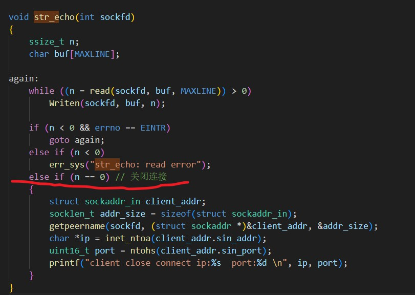

## 概述
```c
lsof -i:port
查询该端口的状态


COMMAND      PID   USER   FD   TYPE  DEVICE SIZE/OFF NODE NAME
tcpserv01 138552 liuxin    3u  IPv4 1265668      0t0  TCP *:9877 (LISTEN)


netstat -a
Proto Recv-Q Send-Q Local Address           Foreign Address         State 
tcp        0      0 0.0.0.0:9877            0.0.0.0:*               LISTEN 


状态:
LISTEN


bind 的值 INADDR_ANY
Local Address  
0.0.0.0:9877


客户端1数据
tcp        0      0 localhost:9877          localhost:55984         ESTABLISHED

客户端2数据
tcp        0      0 localhost:9877          localhost:54456         ESTABLISHED


客户端3 数据 不同主机并且跨越网络
tcp        0      0 iZ8vb3f8wnppje33dr:9877 182.149.182.88:18958    ESTABLISHED


ps l 获取进程信息
F   UID     PID    PPID PRI  NI    VSZ   RSS WCHAN  STAT TTY        TIME COMMAND
0  1000  121426  121372  20   0   7768  4444 do_wai Ss   pts/3      0:00 /bin/bash --init-file /home/
0  1000  137767  121372  20   0   7768  4556 do_wai Ss   pts/5      0:00 /bin/bash --init-file /home/
0  1000  140349  121372  20   0   7768  4600 do_wai Ss   pts/7      0:00 /bin/bash --init-file /home/
0  1000  141233  121372  20   0   7768  4484 do_wai Ss   pts/8      0:00 /bin/bash --init-file /home/
0  1000  142294  121426  20   0   2784  1056 inet_c S+   pts/3      0:00 ./tcpserv01
0  1000  142314  140349  20   0   2788   952 wait_w S+   pts/7      0:00 ./tcpcli01 127.0.0.1
1  1000  142315  142294  20   0   2784    96 wait_w S+   pts/3      0:00 ./tcpserv01
0  1000  142335  137767  20   0   2788   928 wait_w S+   pts/5      0:00 ./tcpcli01 127.0.0.1
1  1000  142336  142294  20   0   2784    96 wait_w S+   pts/3      0:00 ./tcpserv01


ppid 父进程id 号
    
F   UID     PID    PPID PRI  NI    VSZ   RSS WCHAN  STAT TTY        TIME COMMAND

bash 程序
0  1000  121426  121372  20   0   7768  4444 do_wai Ss   pts/3      0:00 /bin/bash 

父进程
0  1000  142294  121426  20   0   2784  1056 inet_c S+   pts/3      0:00 ./tcpserv01

下面两个是子进程
1  1000  142315  142294  20   0   2784    96 wait_w S+   pts/3      0:00 ./tcpserv01
1  1000  142336  142294  20   0   2784    96 wait_w S+   pts/3      0:00 ./tcpserv01


STAT
    I 空闲/睡眠状态
    
    ./xxx& 后台执行就出现+
    + 表示为控制终端前后进程


WCHAN
    - or running
    如果系统正在等待某个时间会显示正在等待的内核函数

```

## 正常终止

```c

//客户端连接
tcp        0      0 localhost:43198         localhost:9877          ESTABLISHED

// 客户端主动关闭
Ctrl+D 是终端EOF字符

// 客户端变为 TIME_WAIT
tcp        0      0 localhost:43198         localhost:9877          TIME_WAIT  

```


### note
```

1  1000  150625  150591  20   0      0     0 -      Z+   pts/3      0:00 [tcpserv01] <defunct>
1  1000  152506  150591  20   0      0     0 -      Z+   pts/3      0:00 [tcpserv01] <defunct>


STATT Z+
子进程发送SIGCHLD 父进程 未捕获该信号,子进程的就成了僵尸进程
```

## Posix 信号处理
```c
信号可以
1.由一进程发送另一个进程
2.由内核发送某一进程


信号的处理的三种方式
方式1:
    function signal handler  catching
    note:
      有两个信号是不能捕获的 sigkill 和 sigtop


    /*
        信号处理函数原型
    */
    void handler(int signo)

方式2:
    设置处理办法未SIG_IGN来忽略它
     note:
        sigkill 和 sigstop不能忽略
    

方式3:
    SIG_DFL 设置缺省处理办法

    一般:缺省处理办法收益在接收到信号时终止程序
    特定信号 还要在当前工作目录产生进程的核心映像
 
```
### signal 函数
```
1.较为复杂:
    posix 方法调用sigaction()函数


Posix信号语义
1.一旦安装信号处理函数会一直安装
  note: 早起的系统是每执行一次会将其拆除


```
## 处理SIGCHILD信号
```
如果有进程的子经常处于僵尸状态,则所有处于僵尸子进程的父经常ID均设置为1.
init 进程 将作为这些僵尸进程的继父负责清除他们(init 将 wait 它们)
   note:有些UNIX将僵尸进程的COMMAND 列为 <default>

```
### 处理僵尸进程
```
1.建立子进程必须等待
   建立一个信号处理程序来捕获信号SIGCHILD,
   信号处理程序调用wait 函数

2.信号处理程序 必须 要在fork第一个子进程之前 创建(只能创建一个信号处理程序)


```
### 处理被中断的系统调用
```c
慢系统调用:
  accept()
  对于那些永远阻塞(可能永远无法返回)的系统函数


正在执行慢系统调用,系统捕获到一个信号,则系统调用可能返回EINTR的错误


for(;;){
    if(connfd=accept()<0){
        if(errno=EINTR){ 系统中断错误

        }else{
            
        }
    }
}

read writ select open 都能自动重启
note:
   connect 捕获信号中断而不自动重启


```
## wait 和 waitpid 函数
```

```


